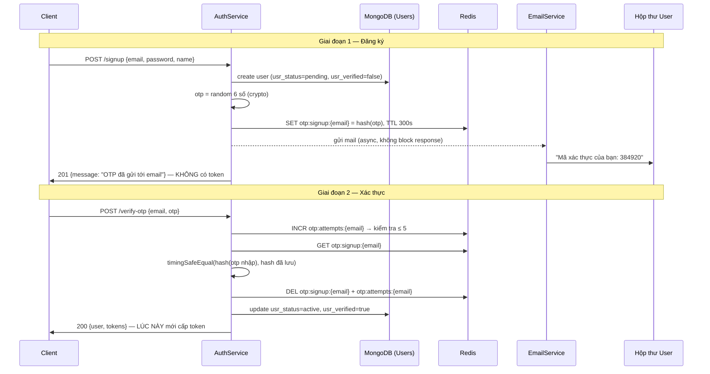
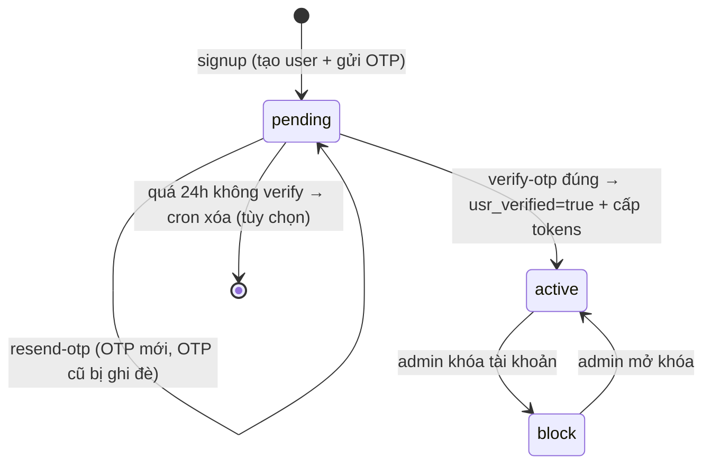

# Xác thực đăng ký User bằng OTP qua Email

> Tài liệu định nghĩa chức năng (Feature Definition) — viết theo phong cách mentoring: không chỉ mô tả *làm gì*, mà giải thích *tại sao* và *trade-off* của từng quyết định thiết kế.

---

## 1. Overview — Tổng quan

### Chức năng này là gì?

Khi user đăng ký tài khoản (`POST /signup`), thay vì kích hoạt tài khoản ngay lập tức, hệ thống sẽ:

1. Tạo user ở trạng thái **`pending`** (chưa xác thực).
2. Sinh một mã **OTP (One-Time Password)** — 6 chữ số ngẫu nhiên.
3. Gửi OTP đến email user vừa đăng ký.
4. User nhập OTP → hệ thống xác thực → tài khoản chuyển sang **`active`** → cấp token đăng nhập.

### Tại sao cần nó?

Nhìn vào code hiện tại của dự án ([src/features/auth/services/index.ts](../src/features/auth/services/index.ts)), hàm `signup` đang có một lỗ hổng nghiệp vụ:

```ts
// Hiện tại: tạo user xong là CẤP TOKEN NGAY — không hề xác thực email
const newUser = await UserModel.create({ usr_email: email, ... })
const tokens = await this.reissueTokens(payload)   // ← user chưa chứng minh email là của họ
```

Điều này nghĩa là:

- **Bất kỳ ai cũng có thể đăng ký bằng email của người khác.** Nếu sau này hệ thống gửi hóa đơn, thông báo đơn hàng, hay link reset password qua email đó — thông tin bị gửi nhầm người.
- **Database chứa đầy email rác/không tồn tại** — làm hỏng chất lượng dữ liệu, tăng bounce rate khi gửi marketing email (ảnh hưởng trực tiếp đến domain reputation).
- **Bot có thể tạo hàng loạt tài khoản** để abuse mã giảm giá (dự án này có feature `discount`), spam comment, v.v.

### Nó giải quyết vấn đề gì?

**Chứng minh quyền sở hữu email (proof of ownership).** OTP gửi qua email là một "challenge" — chỉ người thực sự đọc được hộp thư đó mới trả lời đúng. Đây là nguyên lý nền tảng của mọi hệ thống xác thực: *"something you have"* (quyền truy cập hộp thư) bổ sung cho *"something you know"* (password).

Điều đáng chú ý: schema `UserModel` của dự án **đã được thiết kế sẵn cho việc này** nhưng chưa dùng đến:

```ts
// src/features/user/models/index.ts — đã có sẵn, đang bị bỏ quên
usr_status: { enum: ['active', 'pending', 'block'], default: 'active' }  // ← default nên đổi thành 'pending'
usr_verified: { type: Boolean, default: false }                          // ← chưa ai set true
```

---

## 2. Mental Model — Mô hình tư duy

Hãy hình dung OTP flow như **nhận bưu phẩm cần ký nhận**:

- Bạn đặt hàng (signup) → shipper mang hàng đến địa chỉ bạn khai (email).
- Shipper yêu cầu bạn đọc **mã xác nhận** in trên phiếu (OTP) — chỉ người ở đúng địa chỉ đó mới thấy được mã.
- Đọc đúng mã → nhận hàng (account active). Đọc sai nhiều lần → shipper mang hàng về (OTP bị khóa).
- Phiếu chỉ có giá trị trong ngày (TTL) — để lâu quá phải yêu cầu giao lại (resend).

Ba tính chất cốt lõi của OTP nằm ngay trong tên gọi và mô hình này:

| Tính chất | Ý nghĩa |
| --------- | ------- |
| **One-Time** | Dùng đúng 1 lần. Verify xong (dù đúng hay hết lượt thử) là mã bị hủy. |
| **Short-lived** | Sống ngắn (thường 2–5 phút). Hết hạn là vô giá trị. |
| **Out-of-band** | Gửi qua một kênh khác (email) so với kênh đang giao tiếp (HTTP API). Kẻ tấn công phải chiếm được *cả hai kênh* mới phá được. |

Một mental model quan trọng khác: **OTP là dữ liệu phù du (ephemeral), không phải dữ liệu nghiệp vụ.** Nó giống session hơn là user record → vì vậy lưu ở **Redis với TTL** chứ không lưu MongoDB. Redis tự xóa khi hết hạn — bạn không cần cron job dọn dẹp.

---

## 3. First Principles — Vấn đề kỹ thuật gốc rễ

Trước khi nhảy vào implement, hãy hiểu bài toán mà các kỹ sư đã phải giải qua từng thời kỳ:

### Bài toán: làm sao xác minh một định danh mà server không thể tự kiểm chứng?

Server không có cách nào biết `sang@example.com` có thật và thuộc về người đang gõ phím hay không. Cách duy nhất: **gửi một bí mật đến định danh đó và yêu cầu người dùng lặp lại bí mật**.

### Các thế hệ giải pháp và giới hạn của chúng

**Thế hệ 1 — Verification Link (link kích hoạt):**
Gửi email chứa link `https://site.com/verify?token=abc123`. User bấm link là xong.

- ✅ UX một chạm.
- ❌ Cần frontend page để xử lý link → không phù hợp cho mobile app hoặc API-first backend (như dự án này — pure REST API).
- ❌ Email client/antivirus hay **tự động crawl link** để quét malware → token bị "dùng" trước cả khi user bấm → lỗi "token already used" nổi tiếng khó debug.
- ❌ Token dài nằm trong URL → lộ qua browser history, proxy logs, Referer header.

**Thế hệ 2 — OTP dạng số (giải pháp ta chọn):**
Gửi mã 6 số, user tự gõ vào form.

- ✅ Kênh nhập liệu tách khỏi kênh nhận mã → antivirus crawl email cũng không kích hoạt được gì.
- ✅ Hoạt động với mọi client: web, mobile, CLI, Postman.
- ✅ Mã ngắn, user gõ được → nhưng chính vì ngắn nên **bắt buộc phải có chống brute-force** (chỉ có 10⁶ = 1 triệu khả năng).
- ❌ UX nhiều bước hơn link.

**Thế hệ 3 — Magic link + OTP hybrid, hoặc OAuth (Sign in with Google):**
Ủy quyền việc xác thực email cho bên thứ ba. Ngoài phạm vi tài liệu này, nhưng nên biết nó tồn tại — nếu sau này dự án thêm "Login with Google" thì bước OTP có thể bỏ qua cho những user đó (Google đã xác thực email hộ rồi).

### Tại sao khoá học rút ra: OTP phải được HASH trước khi lưu

Nguyên tắc giống hệt password: **không bao giờ lưu bí mật ở dạng plaintext**. Nếu Redis bị dump (misconfigured, RDB file lộ), attacker đọc được toàn bộ OTP đang hiệu lực và chiếm mọi tài khoản đang chờ xác thực. Hash một chiều (SHA-256 kèm secret, hoặc bcrypt) khiến dữ liệu dump ra vô giá trị.

---

## 4. Internal Implementation — Cơ chế bên trong

### Kiến trúc tổng thể

Feature này chạm vào 3 tầng của dự án, cộng thêm 2 thành phần mới:

```
src/features/auth/
├── controllers/index.ts      ← thêm verifyOtp, resendOtp handlers
├── routes/index.ts           ← thêm POST /verify-otp, POST /resend-otp
├── services/
│   ├── index.ts              ← sửa signup, thêm verifyOtp, resendOtp
│   └── otp.service.ts        ← MỚI: sinh/lưu/kiểm tra OTP (Redis)
└── dtos/                     ← thêm VerifyOtpDto, ResendOtpDto (zod)

src/services/
└── email.service.ts          ← MỚI: gửi mail qua nodemailer (SMTP)
```

### Data flow — luồng dữ liệu



### State transitions — vòng đời trạng thái user



**Điểm mấu chốt:** `login` phải từ chối user `pending`. Nếu quên bước này, toàn bộ flow OTP trở nên vô nghĩa — user cứ signup rồi login thẳng, bỏ qua verify.

### Thiết kế Redis keys

OTP là dữ liệu ephemeral → Redis là nơi lưu đúng đắn (dự án đã có sẵn `pubClient` trong [src/utils/redis.util.ts](../src/utils/redis.util.ts)). Ba nhóm key:

| Key | Value | TTL | Mục đích |
| --- | ----- | --- | -------- |
| `otp:signup:{email}` | SHA-256 hash của OTP | 300s (5 phút) | Mã đang chờ xác thực |
| `otp:attempts:{email}` | số lần nhập sai | 300s | Chống brute-force: tối đa 5 lần thử |
| `otp:resend:{email}` | `1` | 60s | Cooldown: không cho spam resend |

Tại sao dùng TTL của Redis thay vì lưu `expiresAt` trong MongoDB rồi tự so sánh? Vì Redis **tự động xóa** key hết hạn — không cần cron dọn rác, không có nguy cơ quên xóa, và thao tác `GET` trả `null` là biết ngay mã hết hạn. Đây là ví dụ điển hình của việc *chọn đúng công cụ thì logic tự đơn giản*.

### Lifecycle của một OTP

```
sinh ra (crypto.randomInt) → hash → lưu Redis kèm TTL
   │
   ├─ user nhập đúng  → DEL ngay → kích hoạt user     (happy path)
   ├─ user nhập sai 5 lần → DEL ngay → phải resend    (brute-force protection)
   ├─ hết 5 phút → Redis tự xóa                        (expiry)
   └─ user bấm resend → bị GHI ĐÈ bởi mã mới           (chỉ 1 mã hiệu lực tại 1 thời điểm)
```

---

## 5. Step-by-Step Walkthrough — Đi qua toàn bộ luồng

### Bước 1 — Input: `POST /v1/api/auth/signup`

```json
{ "email": "sang@example.com", "password": "S3cret!@#", "name": "Sang" }
```

**Processing:**

1. Validate input (zod DTO — dự án đã dùng zod).
2. Kiểm tra email đã tồn tại chưa:
   - Nếu tồn tại và `active` → lỗi `User already exists`.
   - Nếu tồn tại và `pending` → **không tạo mới**, chỉ resend OTP (xử lý trường hợp user signup rồi bỏ dở).
3. Hash password bằng bcrypt (giữ nguyên logic cũ).
4. Tạo user với `usr_status: 'pending'`, `usr_verified: false`.
5. Sinh OTP: `crypto.randomInt(0, 1_000_000)` → pad thành 6 chữ số.
6. Hash OTP → `SETEX otp:signup:sang@example.com 300 <hash>`.
7. Gửi email **bất đồng bộ** — response không chờ SMTP.

**Output:** `201` — chú ý **không trả tokens**:

```json
{ "message": "Mã xác thực đã được gửi tới email của bạn", "email": "sang@example.com" }
```

### Bước 2 — Input: `POST /v1/api/auth/verify-otp`

```json
{ "email": "sang@example.com", "otp": "384920" }
```

**Processing:**

1. `INCR otp:attempts:{email}` — nếu > 5 → xóa OTP, báo lỗi "quá số lần thử, hãy yêu cầu mã mới". (INCR *trước khi* so sánh — xem mục Common Mistakes vì sao thứ tự này quan trọng.)
2. `GET otp:signup:{email}` — `null` nghĩa là hết hạn/chưa từng gửi → lỗi "mã không hợp lệ hoặc đã hết hạn".
3. So sánh `hash(otp nhập vào)` với hash đã lưu bằng `crypto.timingSafeEqual` (chống timing attack).
4. Đúng → `DEL` cả hai key ngay lập tức (đảm bảo tính one-time).
5. Update MongoDB: `usr_status: 'active'`, `usr_verified: true`.
6. Cấp token pair qua `reissueTokens` (logic sẵn có của dự án).

**Output:** `200` — giống response login hiện tại:

```json
{ "user": { "_id": "...", "usr_email": "...", "usr_name": "..." }, "tokens": { "accessToken": "...", "refreshToken": "..." } }
```

### Bước 3 — Input: `POST /v1/api/auth/resend-otp`

```json
{ "email": "sang@example.com" }
```

**Processing:**

1. Kiểm tra `otp:resend:{email}` tồn tại → còn cooldown → lỗi `429 Too Many Requests`.
2. Kiểm tra user tồn tại và đang `pending` — nhưng **response giống hệt nhau dù email có tồn tại hay không** (chống user enumeration, xem mục Security).
3. Sinh OTP mới, ghi đè key cũ, reset attempts, set cooldown 60s.
4. Gửi mail.

**Output:** `200 { "message": "Nếu email tồn tại, mã xác thực mới đã được gửi" }`

---

## 6. Practical Examples — Ví dụ thực tế

### Beginner — OtpService tối giản (đủ hiểu cơ chế)

```ts
// src/features/auth/services/otp.service.ts
import crypto from 'crypto'
import { pubClient as redis } from '../../../utils/redis.util'

const OTP_TTL = 300 // 5 phút
const hashOtp = (otp: string) =>
  crypto.createHmac('sha256', process.env.OTP_SECRET!).update(otp).digest('hex')

class OtpService {
  static async generate(email: string): Promise<string> {
    // crypto.randomInt — KHÔNG dùng Math.random (không đủ ngẫu nhiên cho bảo mật)
    const otp = crypto.randomInt(0, 1_000_000).toString().padStart(6, '0')
    await redis.setEx(`otp:signup:${email}`, OTP_TTL, hashOtp(otp))
    return otp // trả plaintext để gửi mail — KHÔNG log ra đâu cả
  }

  static async verify(email: string, otp: string): Promise<boolean> {
    const stored = await redis.get(`otp:signup:${email}`)
    if (!stored) return false // hết hạn hoặc chưa gửi
    const match = crypto.timingSafeEqual(
      Buffer.from(hashOtp(otp)),
      Buffer.from(stored),
    )
    if (match) await redis.del(`otp:signup:${email}`) // one-time: dùng xong xóa ngay
    return match
  }
}
export default OtpService
```

### Intermediate — thêm chống brute-force và cooldown

```ts
// Bổ sung vào OtpService
static MAX_ATTEMPTS = 5
static RESEND_COOLDOWN = 60

static async verify(email: string, otp: string): Promise<boolean> {
  // 1. Đếm lượt thử TRƯỚC khi so sánh — kẻ tấn công không được thử miễn phí
  const attempts = await redis.incr(`otp:attempts:${email}`)
  if (attempts === 1) await redis.expire(`otp:attempts:${email}`, OTP_TTL)
  if (attempts > this.MAX_ATTEMPTS) {
    await redis.del(`otp:signup:${email}`) // đốt luôn mã — buộc phải resend
    throw new BadRequestError('Too many attempts. Please request a new code.')
  }

  const stored = await redis.get(`otp:signup:${email}`)
  if (!stored) return false

  const match = crypto.timingSafeEqual(
    Buffer.from(hashOtp(otp)), Buffer.from(stored),
  )
  if (match) {
    await redis.del(`otp:signup:${email}`, `otp:attempts:${email}`)
  }
  return match
}

static async canResend(email: string): Promise<boolean> {
  // SET NX = chỉ set nếu chưa tồn tại → vừa kiểm tra vừa đặt cooldown, atomic
  const ok = await redis.set(`otp:resend:${email}`, '1', {
    NX: true, EX: this.RESEND_COOLDOWN,
  })
  return ok === 'OK'
}
```

### Production — tích hợp đầy đủ vào AuthService

```ts
// src/features/auth/services/index.ts — signup sửa lại
static signup = async ({ email, password, name }: SignupInput) => {
  const existing = await UserModel.findOne({ usr_email: email }).lean()

  if (existing) {
    if (existing.usr_status === USER_STATUS.ACTIVE) {
      throw new BadRequestError('User already exists')
    }
    // User pending signup lại → coi như resend, không tạo bản ghi trùng
    if (await OtpService.canResend(email)) {
      const otp = await OtpService.generate(email)
      EmailService.sendOtpMail(email, otp).catch((err) =>
        logger.error('Send OTP mail failed', { err, email }),
      )
    }
    return { message: 'OTP has been sent to your email', email }
  }

  const userRole = await RoleModel.findOne({ rol_name: ROLE_NAME.USER }).lean()
  if (!userRole) throw new BadRequestError('Default role not be set')

  const salt = await bcrypt.genSalt(10)
  const hashPassword = await bcrypt.hash(password, salt)
  await UserModel.create({
    usr_email: email,
    usr_password: hashPassword,
    usr_name: name,
    usr_roles: [userRole._id],
    usr_status: USER_STATUS.PENDING,   // ← khác biệt then chốt so với code cũ
    usr_verified: false,
  })

  const otp = await OtpService.generate(email)
  // fire-and-forget CÓ bắt lỗi — không để user chờ SMTP, không để lỗi mail rơi vào hư không
  EmailService.sendOtpMail(email, otp).catch((err) =>
    logger.error('Send OTP mail failed', { err, email }),
  )

  return { message: 'OTP has been sent to your email', email }
}

static verifyOtp = async ({ email, otp }: { email: string; otp: string }) => {
  const valid = await OtpService.verify(email, otp)
  if (!valid) throw new BadRequestError('Invalid or expired OTP')

  const user = await UserModel.findOneAndUpdate(
    { usr_email: email, usr_status: USER_STATUS.PENDING },
    { usr_status: USER_STATUS.ACTIVE, usr_verified: true },
    { new: true },
  ).populate({ path: 'usr_roles', select: 'rol_name' })
  if (!user) throw new BadRequestError('User not found or already verified')

  const roles = (user.usr_roles as any[]).map((r) => r.rol_name)
  const tokens = await this.reissueTokens({
    userId: String(user._id), email, roles,
  })
  return {
    user: getInfoData({ fields: ['_id', 'usr_email', 'usr_name'], object: user }),
    tokens,
  }
}
```

```ts
// src/features/auth/services/index.ts — login PHẢI chặn user chưa verify
static login = async ({ email, password }) => {
  const user = await UserModel.findOne({ usr_email: email })...
  if (!user) throw new BadRequestError('User not found')

  if (user.usr_status === USER_STATUS.PENDING) {
    throw new UnauthorizedError('Please verify your email first')
  }
  if (user.usr_status === USER_STATUS.BLOCK) {
    throw new UnauthorizedError('Account has been blocked')
  }
  // ... phần còn lại giữ nguyên
}
```

```ts
// src/services/email.service.ts — MỚI (cần: pnpm add nodemailer && pnpm add -D @types/nodemailer)
import nodemailer from 'nodemailer'
import logger from '../loggers'

const transporter = nodemailer.createTransport({
  host: process.env.SMTP_HOST,          // dev: dùng Mailtrap/MailHog, không cần SMTP thật
  port: Number(process.env.SMTP_PORT ?? 587),
  secure: process.env.SMTP_SECURE === 'true',
  auth: { user: process.env.SMTP_USER, pass: process.env.SMTP_PASS },
})

class EmailService {
  static async sendOtpMail(to: string, otp: string) {
    await transporter.sendMail({
      from: process.env.SMTP_FROM ?? '"Ecommerce" <no-reply@ecommerce.local>',
      to,
      subject: 'Mã xác thực đăng ký tài khoản',
      html: `
        <p>Mã xác thực của bạn là:</p>
        <h2 style="letter-spacing: 4px">${otp}</h2>
        <p>Mã có hiệu lực trong <b>5 phút</b>. Không chia sẻ mã này với bất kỳ ai.</p>
        <p>Nếu bạn không thực hiện đăng ký, hãy bỏ qua email này.</p>
      `,
    })
    logger.info('OTP mail sent', { to }) // log người nhận, TUYỆT ĐỐI không log otp
  }
}
export default EmailService
```

```ts
// src/features/auth/routes/index.ts — thêm 2 route public (TRƯỚC middleware authentication)
router.post('/signup', asyncHandler(AuthController.signup))
router.post('/verify-otp', asyncHandler(AuthController.verifyOtp))   // MỚI
router.post('/resend-otp', asyncHandler(AuthController.resendOtp))   // MỚI
router.post('/login', asyncHandler(AuthController.login))
```

Biến môi trường cần thêm vào `.env`:

```bash
OTP_SECRET=<chuỗi ngẫu nhiên dài, dùng cho HMAC>
SMTP_HOST=sandbox.smtp.mailtrap.io
SMTP_PORT=587
SMTP_USER=...
SMTP_PASS=...
SMTP_FROM="Ecommerce <no-reply@yourdomain.com>"
```

---

## 7. Common Mistakes — Lỗi kinh điển

### 1. Quên chặn login cho user `pending`

**Vì sao xảy ra:** OTP flow được code như một feature độc lập, người viết chỉ tập trung vào signup/verify mà quên rằng login là "cửa sau".
**Hậu quả:** toàn bộ cơ chế xác thực trở thành trang trí — user signup, nhận lỗi gì đó ở bước verify, thử login... và vào được luôn.
**Cách tránh:** viết test case *"user pending không login được"* trước khi code (TDD). Đây là test quan trọng nhất của cả feature.

### 2. So sánh OTP rồi mới đếm attempts

```ts
// SAI: attacker gửi 1 triệu request song song, tất cả đều "chưa bị đếm"
const stored = await redis.get(key)
if (otp === stored) { ... }
await redis.incr(attemptsKey)  // đếm sau — quá muộn
```

**Vì sao xảy ra:** trực giác "chỉ đếm khi sai" nghe hợp lý. Nhưng giữa `GET` và `INCR` là một khoảng race — với 6 chữ số (10⁶ khả năng) và vài nghìn request/giây, brute-force thành công trong vài phút.
**Cách tránh:** `INCR` **trước**, so sánh **sau**. Nhập đúng thì reset counter, không thiệt gì cho user thật.

### 3. Dùng `Math.random()` để sinh OTP

**Vì sao xảy ra:** `Math.random()` quen tay. Nhưng nó là PRNG có thể dự đoán được — với đủ mẫu quan sát, attacker khôi phục được seed và đoán trước OTP tiếp theo.
**Cách tránh:** luôn dùng `crypto.randomInt()` cho mọi giá trị mang tính bảo mật.

### 4. `await` việc gửi mail trong request signup

**Vì sao xảy ra:** thói quen `await` mọi async call.
**Hậu quả:** SMTP handshake mất 1–5 giây (có khi timeout 30s) → API signup chậm/timeout theo → user bấm signup lại → duplicate flow. Tệ hơn: SMTP sập kéo sập luôn tính năng đăng ký.
**Cách tránh:** fire-and-forget với `.catch()` ghi log (mức tối thiểu), hoặc đẩy vào message queue (mức production — xem mục 11).

### 5. Log OTP ra console/file log

**Vì sao xảy ra:** debug lúc dev — `logger.info('OTP created', { otp })` — rồi quên xóa.
**Hậu quả:** dự án này dùng `winston-daily-rotate-file`, log lưu trên disk. Ai đọc được log = chiếm được mọi tài khoản đang đăng ký. Log cũng thường được ship sang hệ thống thứ ba (ELK, Datadog) — bí mật lan ra ngoài tầm kiểm soát.
**Cách tránh:** quy ước cứng trong team: *secret không bao giờ xuất hiện trong log*, kể cả log debug. Muốn test ở local, dùng MailHog/Mailtrap để xem mail thật.

### 6. Trả lỗi khác nhau cho "email không tồn tại" vs "OTP sai"

**Vì sao xảy ra:** muốn thân thiện với user, trả message cụ thể.
**Hậu quả:** attacker dùng endpoint `resend-otp`/`verify-otp` làm "máy dò" xem email nào đã đăng ký hệ thống (user enumeration) — dữ liệu quý để phishing.
**Cách tránh:** mọi nhánh lỗi liên quan đến định danh trả cùng một message chung chung: *"Mã không hợp lệ hoặc đã hết hạn"*.

### 7. Không xử lý user `pending` signup lại lần nữa

**Vì sao xảy ra:** code chỉ check `existing` → throw `User already exists`.
**Hậu quả:** user signup, mail vào spam, họ không verify được; hôm sau signup lại thì bị chặn "đã tồn tại" — nhưng cũng không login được vì `pending`. **Tài khoản kẹt vĩnh viễn.**
**Cách tránh:** như code production ở mục 6 — email `pending` signup lại thì resend OTP thay vì throw. Cân nhắc thêm cron xóa user `pending` quá 24h.

---

## 8. Trade-offs — Đánh đổi

| Advantage | Disadvantage |
| --------- | ------------ |
| Đảm bảo email thật, thuộc về người đăng ký — dữ liệu user sạch | Thêm friction: tỷ lệ hoàn thành đăng ký giảm (thường 5–15% user rớt ở bước OTP) |
| Chặn bot đăng ký hàng loạt, chống abuse mã giảm giá | Phụ thuộc hạ tầng email: mail vào spam / trễ = user bị chặn oan |
| OTP trong Redis với TTL: tự dọn dẹp, không rác DB | Thêm một stateful dependency vào flow đăng ký (Redis sập = không ai đăng ký được) |
| Mã 6 số dễ gõ trên mọi thiết bị, không cần frontend xử lý deep-link | Không gian mã nhỏ (10⁶) → bắt buộc kèm rate-limit + attempt limit, không có lựa chọn |
| Nền tảng tái sử dụng được cho reset password, login 2FA sau này | Tăng bề mặt code phải bảo trì: mailer, template, retry, monitoring deliverability |

**Kết luận trade-off:** với hệ thống e-commerce (có tiền, có khuyến mãi, có thông tin đơn hàng gửi qua email), lợi ích vượt xa chi phí. Với một tool nội bộ 10 người dùng thì OTP là over-engineering — hiểu bối cảnh trước khi áp dụng.

---

## 9. Performance Considerations — Hiệu năng

- **Độ trễ API signup:** nếu gửi mail đồng bộ, mỗi signup tốn thêm 1–5s chờ SMTP. Gửi bất đồng bộ đưa response time về ~50ms (chỉ còn bcrypt + 2 lệnh Redis + 1 insert Mongo). Đây là quyết định hiệu năng quan trọng nhất của feature.
- **Redis:** mỗi OTP chiếm ~100 bytes × 3 key. Một triệu user đăng ký đồng thời cũng chỉ tốn vài trăm MB — không đáng lo. Các lệnh `SETEX`/`GET`/`INCR`/`DEL` đều O(1).
- **bcrypt cho OTP — không cần thiết:** password cần bcrypt vì user tái sử dụng password ở nhiều nơi và hash bị lộ có giá trị lâu dài. OTP sống 5 phút, HMAC-SHA256 (vài micro giây) là đủ; bcrypt (~100ms) chỉ làm chậm verify mà không tăng an toàn thực tế — trong 5 phút không ai brute-force offline nổi hash của không gian 10⁶ *kèm secret HMAC*.
- **SMTP throughput:** SMTP provider free-tier thường giới hạn ~100–300 mail/giờ. Chiến dịch marketing kéo 1000 signup/giờ sẽ nghẽn — đó là lúc cần queue (mục 11) và provider trả phí (SES ~$0.10/1000 mail).
- **Scalability:** toàn bộ state nằm ở Redis/MongoDB, không có state trong process Node → scale ngang API server thoải mái, không cần sticky session.

---

## 10. Security Considerations — Bảo mật

Đây là mục quan trọng nhất của feature này, vì OTP *là* một cơ chế bảo mật — làm sai thì tệ hơn không làm (tạo cảm giác an toàn giả).

| Rủi ro | Vector tấn công | Phòng thủ |
| ------ | --------------- | --------- |
| **Brute-force OTP** | Thử 10⁶ mã qua API | Giới hạn 5 lần thử/mã; đốt mã khi vượt; rate-limit theo IP ở tầng middleware |
| **OTP lộ từ storage** | Đọc trộm Redis dump/RDB | Lưu HMAC-SHA256(otp, secret), không lưu plaintext |
| **Timing attack** | Đo thời gian response để đoán từng ký tự | `crypto.timingSafeEqual` thay vì `===` |
| **Replay** | Dùng lại mã đã verify thành công | DEL key ngay khi verify đúng — one-time đúng nghĩa |
| **User enumeration** | Dò email đã đăng ký qua message lỗi | Message lỗi đồng nhất; response `resend-otp` giống nhau dù email tồn tại hay không |
| **Mail bombing** | Spam resend làm nạn nhân ngập hộp thư (và đốt quota SMTP của ta) | Cooldown 60s/lần + trần 10 lần resend/email/ngày |
| **OTP lộ qua log** | Đọc file log, hệ thống log tập trung | Quy ước không log secret; review PR chặn `logger.*(.*otp` |
| **Dự đoán mã** | Khai thác PRNG yếu | `crypto.randomInt`, không dùng `Math.random` |

**Best practices bổ sung:**

- `OTP_SECRET` đặt trong env, khác nhau giữa các môi trường, rotate được.
- Email template ghi rõ *"không chia sẻ mã với bất kỳ ai"* — phòng social engineering (kẻ lừa đảo gọi điện xin mã).
- Không đưa OTP vào URL/query string trong bất kỳ tình huống nào.
- Cân nhắc CAPTCHA ở `/signup` nếu bị bot tấn công — rate-limit theo IP là không đủ với botnet.

---

## 11. Real Production Experience — Kinh nghiệm sản xuất

**Cái gì chạy tốt trong production:**

- Redis TTL cho OTP là pattern chuẩn công nghiệp — gần như mọi hệ thống lớn (Shopee, Tiki, ngân hàng số) đều làm vậy. Nó *just works*.
- OTP 6 số + 5 phút + 5 lần thử là "bộ số vàng" cân bằng UX và bảo mật, đã được kiểm chứng rộng rãi.

**Cái gì hay vỡ trong production:**

- **Email deliverability là nguồn ticket support số một.** Mail vào spam, mail trễ 10 phút (quá TTL!), Gmail throttle IP của SMTP provider... Bài học: (1) TTL đừng đặt quá ngắt — 5 phút là sàn, đừng chơi 60 giây; (2) hiển thị nút resend rõ ràng; (3) dùng domain đã cấu hình SPF/DKIM/DMARC, đừng gửi từ IP trần.
- **SMTP đồng bộ kéo sập signup.** Sự cố kinh điển: SMTP provider chậm → connection pool của Node cạn → toàn bộ API (không riêng signup) treo. Fire-and-forget là mức tối thiểu; mức đúng đắn là **queue**.
- **Quên trần resend theo ngày.** Cooldown 60s nghe ổn cho đến khi một script bấm resend đều đặn mỗi 61 giây suốt đêm — sáng ra quota 300 mail/ngày của SMTP cháy sạch, user thật không nhận được mã.

**Scaling path với message queue:** dự án này đã có sẵn `amqplib` (RabbitMQ) và `kafkajs`. Khi traffic tăng, kiến trúc đúng là:

```
AuthService ──publish──▶ RabbitMQ (queue: email.otp) ──consume──▶ Email Worker ──▶ SMTP
                            │ (retry + DLX khi SMTP lỗi)
```

Lợi ích: signup không bao giờ chờ SMTP; SMTP sập thì message nằm chờ trong queue và tự retry (dự án đã có sẵn ví dụ DLX trong `src/test/message_queue/rabbitmq/producerDLX.ts`); có thể throttle tốc độ gửi để không vượt quota provider. Đây là bước nâng cấp tự nhiên khi hệ thống vượt ~1000 mail/ngày.

---

## 12. Senior Engineer Notes — Ghi chú cho người đi trước

- **Schema đã "biết trước" feature này.** `usr_status: pending` và `usr_verified` nằm sẵn trong model từ đầu — đây là dấu hiệu của thiết kế schema có tầm nhìn. Việc của ta là *dùng* nó, đừng thêm field mới trùng ý nghĩa (ví dụ đừng thêm `is_email_confirmed`). Một nguồn sự thật cho một trạng thái.
- **Tách `OtpService` khỏi `AuthService` không phải để đẹp code** — mà vì OTP sẽ được tái dùng cho *reset password* và *login 2FA* trong tương lai gần. Khi đó chỉ cần đổi namespace key (`otp:reset:{email}`, `otp:2fa:{email}`) mà không đụng logic. Thiết kế key có prefix mục đích (`otp:signup:`) ngay từ đầu chính là để đón trước điều này.
- **Hidden complexity nằm ở email, không nằm ở OTP.** Logic OTP là 50 dòng code; sự phức tạp thật là deliverability, retry, template versioning, đa ngôn ngữ, quota provider. Đừng ước lượng effort của feature này bằng độ dài phần code Redis.
- **Quyết định cần chốt với product trước khi code:** user `pending` quá 24–48h thì làm gì? Xóa (giải phóng email cho người đăng ký lại) hay giữ (giữ chỗ)? Không chốt sớm sẽ sinh bug "email này đã tồn tại nhưng không ai login được". Khuyến nghị: TTL-style cleanup bằng MongoDB TTL index trên user pending, hoặc cho phép signup ghi đè user pending cũ.
- **Đừng version hóa OTP flow theo client.** Mobile và web dùng chung endpoint — kháng cự cám dỗ thêm `?skip_otp=true` cho môi trường test. Thay vào đó, môi trường dev dùng MailHog (SMTP giả, có UI xem mail) — flow giữ nguyên 100%, không có backdoor nào có thể vô tình lọt ra production.
- **Bảo trì dài hạn:** đặt các "magic number" (TTL 300, max 5 attempts, cooldown 60) vào `src/configs` thay vì rải trong code — vận hành sẽ muốn tinh chỉnh chúng theo dữ liệu thực tế mà không cần deploy lại logic.

---

## 13. Interview Knowledge — Kiến thức phỏng vấn

**Câu hỏi thường gặp:**

1. *Tại sao lưu OTP ở Redis mà không phải MongoDB?* — TTL tự động, O(1), dữ liệu ephemeral không cần durability; mất Redis thì user chỉ cần resend, không mất gì nghiêm trọng.
2. *Tại sao phải hash OTP trong khi nó chỉ sống 5 phút?* — Defense in depth: Redis dump/monitor command/backup có thể lộ; hash biến dữ liệu lộ thành vô giá trị. Chi phí hash gần bằng 0 nên không có lý do bỏ qua.
3. *OTP 6 số có 10⁶ khả năng — brute-force trong 5 phút có khả thi không?* — Nếu không giới hạn: 10⁶ request trong 300s = ~3.3k req/s, hoàn toàn khả thi với botnet. Vì vậy attempt limit là bắt buộc, không phải tùy chọn. Với 5 lần thử, xác suất đoán trúng là 5/10⁶ = 0.0005%.
4. *Timing attack với so sánh chuỗi là gì?* — `===` thoát sớm ở byte khác nhau đầu tiên → thời gian phản hồi tiết lộ số byte đúng ở đầu chuỗi → thu hẹp không gian tìm kiếm. `timingSafeEqual` so sánh đủ mọi byte với thời gian cố định.
5. *Idempotency của resend xử lý thế nào?* — `SET NX EX` là thao tác atomic vừa-kiểm-tra-vừa-đặt cooldown, tránh race khi hai request resend đến cùng lúc.

**Điểm thảo luận senior-level:**

- So sánh OTP vs magic link vs TOTP (Google Authenticator): trade-off giữa UX, độ an toàn kênh truyền, và yêu cầu hạ tầng.
- Thiết kế OTP service thành module dùng chung cho nhiều mục đích (signup/reset/2FA) — namespace key, policy khác nhau theo mục đích.
- Chiến lược graceful degradation khi Redis hoặc SMTP sập: circuit breaker, queue buffer, hay tạm tắt yêu cầu verify?
- Tại sao "response đồng nhất chống enumeration" mâu thuẫn với UX tốt, và cách các công ty lớn cân bằng (ví dụ: chỉ đồng nhất ở endpoint public, chi tiết ở kênh đã xác thực).

---

## 14. Best Practices — Khuyến nghị thực hành

1. **`crypto.randomInt`, không `Math.random`** — vì OTP là secret, PRNG thường dự đoán được.
2. **HMAC-SHA256 với secret trong env, không SHA-256 trần** — SHA-256 trần của không gian 10⁶ mã bị brute-force offline trong mili giây nếu Redis lộ; HMAC buộc attacker phải có cả secret.
3. **INCR attempts trước khi so sánh** — mọi lần thử đều bị tính, kể cả khi so sánh crash giữa chừng.
4. **Xóa OTP ngay khi dùng xong hoặc cháy lượt thử** — one-time phải được thực thi bằng code, không phải bằng niềm tin vào TTL.
5. **Gửi mail bất đồng bộ, có bắt lỗi và log** — signup latency không được phụ thuộc SMTP; nhưng lỗi gửi mail phải nhìn thấy được trong log/metrics để vận hành biết deliverability đang hỏng.
6. **Response đồng nhất cho mọi nhánh lỗi định danh** — chống enumeration quan trọng hơn message thân thiện, ở các endpoint chưa xác thực.
7. **Cả cooldown (60s) lẫn trần ngày (10 lần)** — cooldown chống spam nhanh, trần ngày chống spam kiên nhẫn.
8. **Dev dùng MailHog/Mailtrap, không dùng backdoor `skip_otp`** — backdoor môi trường dev là loại bug bảo mật hay rò ra production nhất.
9. **Tách config (TTL, limits) vào `src/configs`** — số liệu vận hành cần chỉnh được không cần đọc lại logic.
10. **Viết test cho các nhánh phòng thủ trước** — test "pending không login được", "quá 5 lần thử bị chặn", "mã dùng rồi không dùng lại được" có giá trị hơn test happy path, vì happy path hỏng thì thấy ngay, còn nhánh phòng thủ hỏng thì chỉ attacker thấy.

---

## 15. Related Concepts — Khái niệm liên quan

```
Email OTP Verification
├── Rate Limiting ──────── chống brute-force/spam; cần thêm tầng IP-based (middleware)
├── Redis TTL / SETEX ──── nền tảng lưu trữ ephemeral; cùng pattern với session, cache
├── Message Queue ──────── RabbitMQ/Kafka (đã có trong dự án) cho gửi mail async + retry
├── JWT Token Pair ─────── feature keyToken hiện có; OTP quyết định THỜI ĐIỂM cấp token
├── Password Reset ─────── flow tái dùng OtpService, chỉ khác namespace và hậu quả
├── 2FA / TOTP ─────────── bước tiến hóa tiếp theo: mã sinh offline (RFC 6238), không cần gửi
├── Email Deliverability ─ SPF, DKIM, DMARC — quyết định mail vào inbox hay spam
└── User Enumeration ───── lớp bảo mật xuyên suốt mọi endpoint auth public
```

**Chuỗi phụ thuộc trong dự án này:** `signup` (auth) → `OtpService` (Redis util sẵn có) → `EmailService` (nodemailer, mới) → `verify-otp` → `usr_status/usr_verified` (user model sẵn có) → `reissueTokens` (keyToken sẵn có).

Nói cách khác: **hầu hết mảnh ghép đã tồn tại trong codebase** — Redis client, user status enum, token service, error classes, logger. Feature này chủ yếu là *lắp ráp đúng thứ tự* cộng hai module mới (`otp.service.ts`, `email.service.ts`). Đó là dấu hiệu của một codebase có nền tảng tốt.
