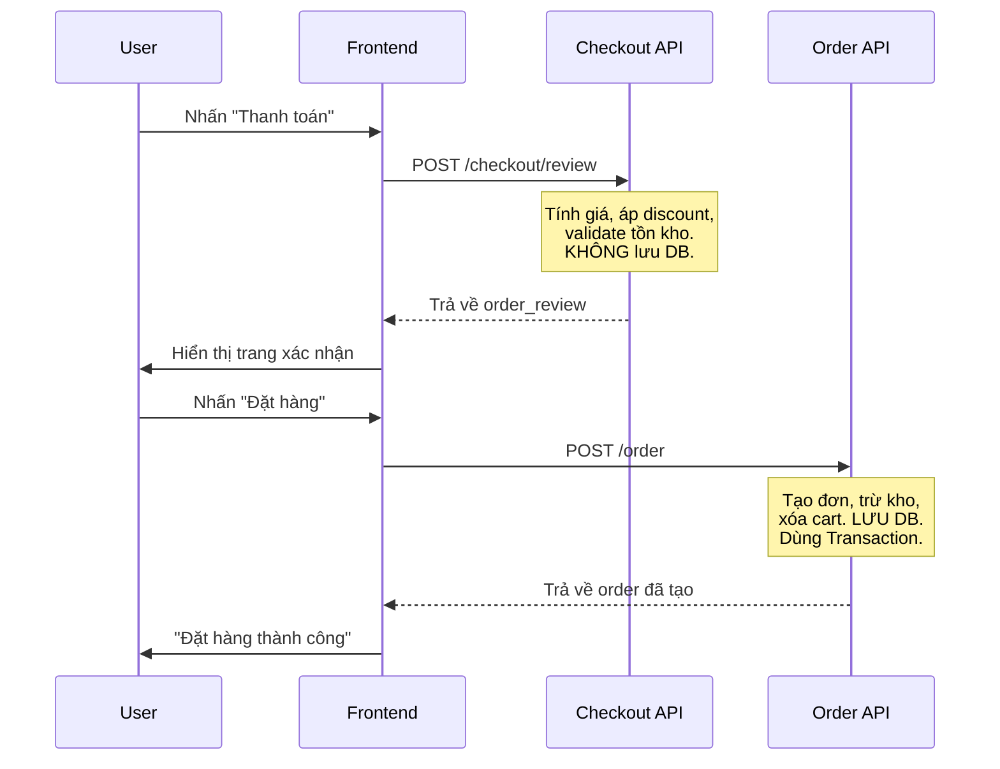
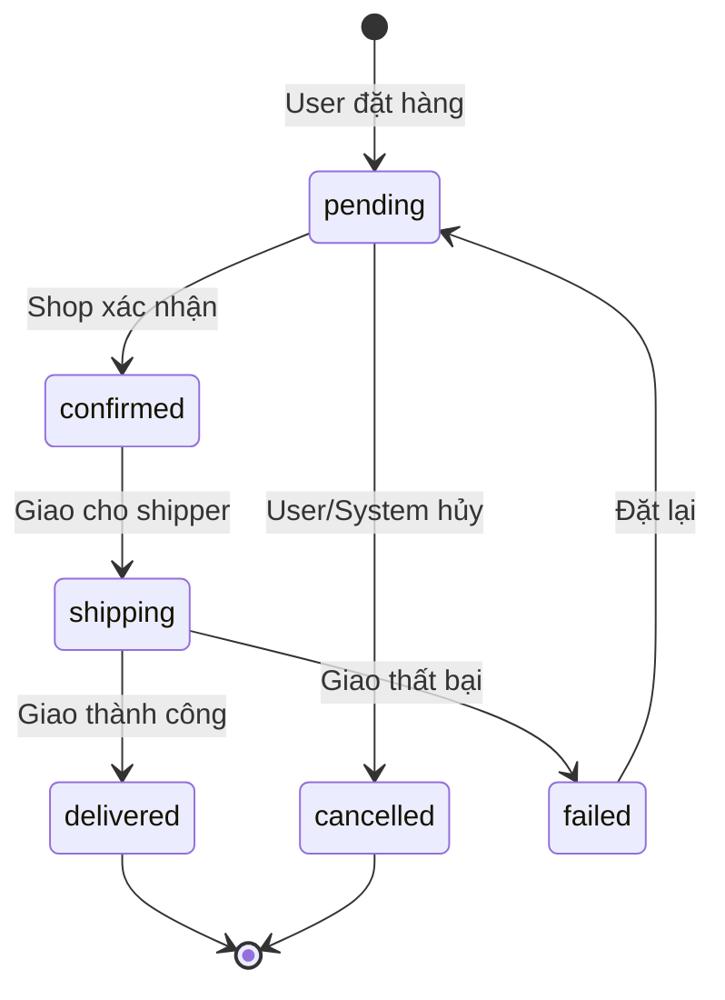
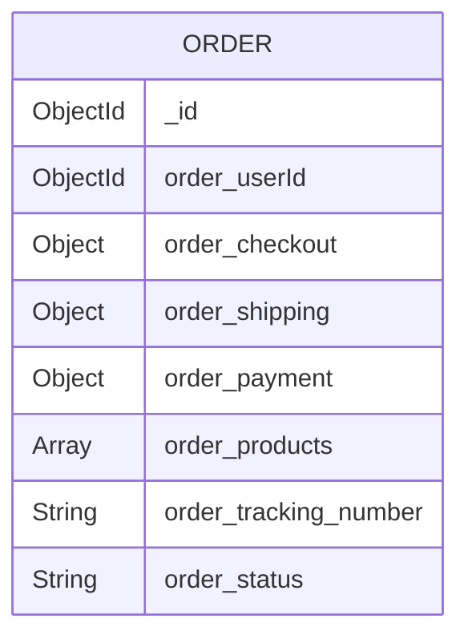

# Hướng dẫn xây dựng Module Order & Checkout

## Mục lục

1. [Kiến thức nền tảng](#1-kiến-thức-nền-tảng)
2. [Thiết kế Database](#2-thiết-kế-database)
3. [Step 1: Tạo Order Model](#step-1-tạo-order-model)
4. [Step 2: Cập nhật Inventory Repository](#step-2-cập-nhật-inventory-repository)
5. [Step 3: Tạo Checkout Service](#step-3-tạo-checkout-service)
6. [Step 4: Tạo Order Repository](#step-4-tạo-order-repository)
7. [Step 5: Tạo Order Service](#step-5-tạo-order-service)
8. [Step 6: Tạo Controllers](#step-6-tạo-controllers)
9. [Step 7: Tạo Routes & Đăng ký](#step-7-tạo-routes--đăng-ký)
10. [Bài tập nâng cao](#bài-tập-nâng-cao)

---

# 1. Kiến thức nền tảng

## Checkout vs Order — Khác nhau thế nào?

| | Checkout | Order |
|---|---|---|
| **Là gì?** | Quá trình **xem lại** đơn hàng trước khi xác nhận | Đơn hàng **đã được xác nhận** |
| **Có lưu DB không?** | **KHÔNG** — chỉ tính toán rồi trả về | **CÓ** — lưu vào collection `Orders` |
| **Khi nào xảy ra?** | User nhấn "Thanh toán" → hiện trang review | User nhấn "Xác nhận đặt hàng" |



## Tại sao tách Checkout ra khỏi Order?

1. **Separation of Concerns** — Tính toán (checkout) và hành động (order) là 2 trách nhiệm khác nhau
2. **UX tốt hơn** — User được xem lại tổng tiền trước khi xác nhận
3. **Idempotent** — Gọi checkout/review nhiều lần không gây side effect
4. **Bảo mật** — Validate lại giá từ server, không tin client

## Inventory Reservation Pattern

> [!IMPORTANT]
> Pattern cực kỳ quan trọng trong E-Commerce thực tế — giải quyết race condition.

**Vấn đề:** 2 user cùng mua sản phẩm cuối cùng → ai được?

**Giải pháp:** Dùng MongoDB atomic operation `$gte` + `$inc`:
```
Tồn kho: 5
User A: qty=3 → inven_stock >= 3? ✅ → stock = 2
User B: qty=3 → inven_stock >= 3? ❌ → return null → throw Error
```

## Order State Machine



---

# 2. Thiết kế Database

> [!TIP]
> **Snapshot Pattern:** Khi tạo order, **copy toàn bộ thông tin sản phẩm** (tên, giá, ảnh) vào order. Lý do: Nếu shop đổi giá sau khi user đặt, order phải giữ nguyên giá tại thời điểm đặt.



---

# Step 1: Tạo Order Model

### Tạo file: `features/order/model/index.ts`

```typescript
import { model, Schema } from 'mongoose'

const DOCUMENT_NAME = 'Order'
const COLLECTION_NAME = 'Orders'

export const ORDER_STATUS = Object.freeze({
  PENDING: 'pending',
  CONFIRMED: 'confirmed',
  SHIPPING: 'shipping',
  DELIVERED: 'delivered',
  CANCELLED: 'cancelled',
  FAILED: 'failed',
})

const orderSchema = new Schema(
  {
    order_userId: {
      type: Schema.Types.ObjectId,
      ref: 'Shop', // tạm dùng Shop làm User
      required: true,
    },
    /*
      order_checkout là snapshot kết quả checkout tại thời điểm đặt hàng.
      Lưu lại để sau này tra cứu mà không cần tính lại.
      {
        totalPrice: number,      // tổng giá gốc
        totalDiscount: number,   // tổng giảm giá
        feeShip: number,         // phí ship
        totalCheckout: number,   // tổng thanh toán thực tế
      }
    */
    order_checkout: {
      type: Object,
      default: {},
      required: true,
    },
    /*
      order_shipping là snapshot thông tin giao hàng.
      {
        street: string,
        city: string,
        state: string,
        country: string,
      }
    */
    order_shipping: {
      type: Object,
      default: {},
      required: true,
    },
    /*
      order_payment là thông tin thanh toán.
      {
        method: 'COD' | 'CARD' | 'MOMO',
      }
    */
    order_payment: {
      type: Object,
      default: {},
      required: true,
    },
    /*
      order_products là snapshot toàn bộ sản phẩm, group theo shop.
      Cấu trúc giống shop_order_ids_new từ checkout review:
      [
        {
          shopId: string,
          shop_discounts: [{ code, shopId }],
          item_products: [{ productId, price, quantity, name, thumb }],
          price_raw: number,
          price_apply_discount: number,
        }
      ]
    */
    order_products: {
      type: Array,
      required: true,
      default: [],
    },
    order_tracking_number: {
      type: String,
      default: '',
    },
    order_status: {
      type: String,
      enum: Object.values(ORDER_STATUS),
      default: ORDER_STATUS.PENDING,
    },
  },
  {
    timestamps: true,
    collection: COLLECTION_NAME,
  },
)

export const OrderModel = model(DOCUMENT_NAME, orderSchema)
```

---

# Step 2: Cập nhật Inventory Repository

### Sửa file: `features/inventory/repository/index.ts`

Thêm 2 hàm `reserveInventory` và `releaseInventory` vào file hiện tại.

```typescript
import mongoose from 'mongoose'
import { InventoryModel } from '../models'

// ===== HÀM CŨ — giữ nguyên =====
export const insertInventory = async ({
  product_id,
  shop_id,
  stock,
  location = 'unKnow',
  session,
}: {
  product_id: mongoose.Types.ObjectId
  shop_id: mongoose.Types.ObjectId
  stock: number
  location?: string
  session: mongoose.ClientSession
}) => {
  const payload = {
    inven_product_id: product_id,
    inven_shop_id: shop_id,
    inven_stock: stock,
    inven_location: location,
  }
  if (session) {
    return (await InventoryModel.create([payload], { session }))[0]
  }
  return await InventoryModel.create(payload)
}

// ===== HÀM MỚI — thêm vào =====

/*
  reserveInventory — Đặt chỗ sản phẩm khi tạo order.

  Cách hoạt động:
  - Dùng { $gte: quantity } để kiểm tra tồn kho đủ hay không
  - Nếu đủ → trừ kho ($inc: -quantity) + thêm reservation
  - Nếu KHÔNG đủ → findOneAndUpdate return null

  Đây là atomic operation — MongoDB đảm bảo không có race condition.
  Không cần pessimistic lock, không cần distributed lock.
*/
export const reserveInventory = async ({
  productId,
  quantity,
  cartId,
  session,
}: {
  productId: string
  quantity: number
  cartId: string
  session: mongoose.ClientSession
}) => {
  return InventoryModel.findOneAndUpdate(
    {
      inven_product_id: new mongoose.Types.ObjectId(productId),
      inven_stock: { $gte: quantity }, // CHỈ update nếu tồn kho >= quantity
    },
    {
      $inc: { inven_stock: -quantity },
      $push: {
        inven_reservation: {
          quantity,
          cartId,
          createdAt: new Date(),
        },
      },
    },
    {
      new: true,
      session,
    },
  )
}

/*
  releaseInventory — Hoàn lại tồn kho khi user hủy order.

  Cách hoạt động:
  - Cộng lại số lượng vào kho ($inc: +quantity)
  - Xóa reservation record ($pull)
*/
export const releaseInventory = async ({
  productId,
  quantity,
  cartId,
  session,
}: {
  productId: string
  quantity: number
  cartId: string
  session: mongoose.ClientSession
}) => {
  return InventoryModel.findOneAndUpdate(
    {
      inven_product_id: new mongoose.Types.ObjectId(productId),
    },
    {
      $inc: { inven_stock: quantity }, // cộng lại kho
      $pull: {
        inven_reservation: { cartId }, // xóa reservation
      },
    },
    {
      new: true,
      session,
    },
  )
}
```

> [!WARNING]
> Lưu ý: Vừa phát hiện bug trong `insertInventory` hiện tại của bạn — có 2 lần gọi `InventoryModel.create` lồng nhau. Hãy sửa branch `if (session)` thành `return (await InventoryModel.create([payload], { session }))[0]` như code trên.

---

# Step 3: Tạo Checkout Service

### Tạo file: `features/checkout/service/index.ts`

```typescript
import { BadRequestError } from '../../../core/error.response'
import { ProductRepository } from '../../product/repository'
import { DiscountService } from '../../discount/services/discount.service'

/*
  Interface cho input từ client.
  Client gửi lên sản phẩm ĐÃ GROUP theo shop.
  Mỗi shop có thể có discount riêng.
*/
interface ShopOrderItem {
  shopId: string
  shop_discounts: Array<{
    code: string
    shopId: string
  }>
  item_products: Array<{
    productId: string
    quantity: number
    price: number // client gửi giá lên → server sẽ VALIDATE lại
  }>
}

interface CheckoutReviewPayload {
  cartId: string
  userId: string
  shop_order_ids: ShopOrderItem[]
}

export class CheckoutService {
  /*
    checkoutReview — Tính toán tổng tiền cho đơn hàng.

    KHÔNG lưu DB. KHÔNG trừ kho. KHÔNG có side effect.
    Chỉ đọc + tính toán + validate + trả về kết quả.

    Flow:
    1. Duyệt từng shop trong shop_order_ids
    2. Với mỗi item: validate sản phẩm tồn tại + giá đúng
    3. Tính giá gốc (rawPrice)
    4. Áp discount nếu có → tính discountAmount
    5. Tính giá sau discount (checkoutPrice)
    6. Trả về tổng cộng
  */
  static checkoutReview = async ({
    cartId,
    userId,
    shop_order_ids,
  }: CheckoutReviewPayload) => {
    // Mảng kết quả sau khi đã validate + tính giá
    const shop_order_ids_new: any[] = []

    // Biến tổng
    let totalPrice = 0 // tổng giá gốc
    let totalDiscount = 0 // tổng discount
    let totalCheckout = 0 // tổng thanh toán
    const feeShip = 0 // phí ship (có thể tính sau)

    // 1. Duyệt từng shop
    for (const shopOrder of shop_order_ids) {
      const { shopId, shop_discounts, item_products } = shopOrder

      // 2. Validate từng sản phẩm
      const validatedProducts: any[] = []
      let rawPrice = 0

      for (const item of item_products) {
        /*
          Luôn lấy giá từ DB, KHÔNG tin giá client gửi lên.
          Tại sao? Vì client có thể sửa giá trong devtools.
          Flow:
          - Client gửi: { productId, price: 100, quantity: 2 }
          - Server lấy từ DB: product.product_price = 150
          - So sánh: 100 !== 150 → throw Error
        */
        const product = await ProductRepository.getProductPublishedById(
          item.productId,
          ['product_name', 'product_thumb', 'product_price', 'product_shop'],
        )

        if (!product) {
          throw new BadRequestError(
            `Product ${item.productId} not found or not published`,
          )
        }

        // Validate giá: client price phải bằng server price
        if (item.price !== product.product_price) {
          throw new BadRequestError(
            `Product ${product.product_name} price has changed. Please refresh.`,
          )
        }

        // Validate shop: sản phẩm phải thuộc đúng shop
        if (product.product_shop?.toString() !== shopId) {
          throw new BadRequestError(
            `Product ${product.product_name} does not belong to this shop`,
          )
        }

        const itemTotal = item.price * item.quantity
        rawPrice += itemTotal

        // Lưu snapshot sản phẩm (dùng cho order sau này)
        validatedProducts.push({
          productId: item.productId,
          price: product.product_price,
          quantity: item.quantity,
          name: product.product_name,
          thumb: product.product_thumb,
        })
      }

      // 3. Áp discount (nếu có)
      let discountAmount = 0

      if (shop_discounts && shop_discounts.length > 0) {
        /*
          Hiện tại DiscountService.applyDiscount là instance method,
          nên cần tạo instance. Nếu bạn refactor thành static method thì
          gọi trực tiếp DiscountService.applyDiscount(...)

          Lưu ý: applyDiscount hiện tại sẽ INCREMENT usage count.
          Trong checkout review, ta chưa muốn tăng count (vì user chưa xác nhận).
          → Bạn nên tạo thêm 1 hàm calculateDiscount trong DiscountService
          chỉ tính toán mà KHÔNG tăng usage count.
          Tạm thời, ta gọi applyDiscount ở đây.
        */
        const discountService = new DiscountService()
        for (const disc of shop_discounts) {
          try {
            const result = await discountService.applyDiscount(
              disc.code,
              userId,
              rawPrice,
              validatedProducts[0]?.productId || '', // first product
            )
            discountAmount += result.discountAmount
          } catch (error) {
            // Nếu discount không hợp lệ → bỏ qua hoặc throw tùy business logic
            // Ở đây ta throw để user biết
            throw error
          }
        }
      }

      // 4. Tính giá sau discount
      const checkoutPrice = rawPrice - discountAmount

      // 5. Cộng vào tổng
      totalPrice += rawPrice
      totalDiscount += discountAmount
      totalCheckout += checkoutPrice

      // 6. Lưu kết quả cho shop này
      shop_order_ids_new.push({
        shopId,
        shop_discounts,
        item_products: validatedProducts,
        price_raw: rawPrice,
        price_apply_discount: checkoutPrice,
      })
    }

    return {
      shop_order_ids, // input gốc
      shop_order_ids_new, // kết quả đã validate + tính giá
      checkout_order: {
        totalPrice,
        totalDiscount,
        feeShip,
        totalCheckout: totalCheckout + feeShip,
      },
    }
  }
}
```

> [!IMPORTANT]
> **Vấn đề với `DiscountService.applyDiscount`:** Hàm hiện tại vừa tính discount vừa tăng `usage count`. Trong checkout review, chưa nên tăng count (vì user chưa xác nhận). Bạn nên tạo thêm hàm `calculateDiscount` trong `DiscountService` chỉ **tính toán** mà **KHÔNG** gọi `incrementUserCount`. Đây là bài tập cho bạn refactor.

---

# Step 4: Tạo Order Repository

### Tạo file: `features/order/repository/index.ts`

```typescript
import mongoose from 'mongoose'
import { OrderModel } from '../model'
import { createPaginationResponse, parsePagination } from '../../../utils'

export class OrderRepository {
  // Tạo order — truyền session để nằm trong transaction
  static createOrder = async ({
    payload,
    session,
  }: {
    payload: any
    session: mongoose.ClientSession
  }) => {
    return (await OrderModel.create([payload], { session }))[0]
  }

  // Lấy danh sách orders của 1 user, có phân trang
  static getOrdersByUserId = async ({
    userId,
    page = 1,
    limit = 10,
  }: {
    userId: string
    page?: number
    limit?: number
  }) => {
    const {
      skip,
      limit: limitNum,
      page: pageNum,
    } = parsePagination({ page, limit })

    const [result, total] = await Promise.all([
      OrderModel.find({ order_userId: userId })
        .sort({ createdAt: -1 }) // mới nhất trước
        .skip(skip)
        .limit(limitNum)
        .lean()
        .exec(),
      OrderModel.countDocuments({ order_userId: userId }),
    ])

    return createPaginationResponse(result, total, pageNum, limitNum)
  }

  // Lấy chi tiết 1 order
  static getOrderById = async (orderId: string) => {
    return OrderModel.findById(orderId).lean().exec()
  }

  // Cập nhật trạng thái order
  static updateOrderStatus = async ({
    orderId,
    status,
    session,
  }: {
    orderId: string
    status: string
    session?: mongoose.ClientSession
  }) => {
    return OrderModel.findByIdAndUpdate(
      orderId,
      { order_status: status },
      { new: true, lean: true, session },
    )
  }
}
```

---

# Step 5: Tạo Order Service

### Tạo file: `features/order/service/index.ts`

```typescript
import mongoose from 'mongoose'
import {
  BadRequestError,
  NotFoundError,
} from '../../../core/error.response'
import { CheckoutService } from '../../checkout/service'
import { reserveInventory, releaseInventory } from '../../inventory/repository'
import { CartService } from '../../cart/service'
import { OrderRepository } from '../repository'
import { ORDER_STATUS } from '../model'

export class OrderService {
  /*
    createOrder — Tạo đơn hàng chính thức.

    Đây là hàm quan trọng nhất. Flow:
    1. Gọi lại checkoutReview để validate + tính giá mới nhất
    2. Mở transaction
    3. Reserve inventory (trừ kho atomic)
    4. Tạo Order document
    5. Xóa cart (hoặc xóa items đã đặt khỏi cart)
    6. Commit / Rollback

    Tại sao gọi lại checkoutReview?
    → Vì giữa lúc user xem checkout page và nhấn "Đặt hàng"
      có thể đã qua vài phút. Giá có thể thay đổi, discount hết hạn,
      tồn kho hết. LUÔN tính lại.
  */
  static createOrder = async ({
    cartId,
    userId,
    shop_order_ids,
    user_address,
    user_payment,
  }: {
    cartId: string
    userId: string
    shop_order_ids: any[]
    user_address: {
      street: string
      city: string
      state: string
      country: string
    }
    user_payment: {
      method: string
    }
  }) => {
    // 1. Gọi lại checkoutReview — validate + tính giá mới nhất
    const checkoutResult = await CheckoutService.checkoutReview({
      cartId,
      userId,
      shop_order_ids,
    })

    const { shop_order_ids_new, checkout_order } = checkoutResult

    // 2. Lấy tất cả products cần trừ kho
    //    Flatten từ shop_order_ids_new ra 1 mảng products
    const allProducts = shop_order_ids_new.flatMap(
      (shopOrder: any) => shopOrder.item_products,
    )

    // 3. Mở transaction
    const session = await mongoose.startSession()
    session.startTransaction()

    try {
      // 4. Reserve inventory cho từng sản phẩm
      for (const product of allProducts) {
        const reservation = await reserveInventory({
          productId: product.productId,
          quantity: product.quantity,
          cartId,
          session,
        })

        /*
          Nếu reservation === null → tồn kho không đủ.
          findOneAndUpdate với điều kiện { inven_stock: { $gte: quantity } }
          sẽ return null khi không tìm thấy document thỏa mãn.
        */
        if (!reservation) {
          throw new BadRequestError(
            `Product ${product.name} is out of stock. Please update your cart.`,
          )
        }
      }

      // 5. Tạo Order document
      const newOrder = await OrderRepository.createOrder({
        payload: {
          order_userId: new mongoose.Types.ObjectId(userId),
          order_checkout: checkout_order,
          order_shipping: user_address,
          order_payment: user_payment,
          order_products: shop_order_ids_new,
          order_status: ORDER_STATUS.PENDING,
        },
        session,
      })

      if (!newOrder) {
        throw new BadRequestError('Failed to create order')
      }

      // 6. Xóa cart sau khi đặt hàng thành công
      //    Lưu ý: clearCart hiện tại không nhận session
      //    → Nếu muốn an toàn hơn, refactor clearCart để nhận session
      await CartService.clearCart({ userId })

      // 7. Commit transaction
      await session.commitTransaction()

      return newOrder
    } catch (error) {
      // Rollback tất cả thay đổi
      await session.abortTransaction()
      throw error
    } finally {
      session.endSession()
    }
  }

  /*
    getOrdersByUser — Lấy danh sách orders của user hiện tại.
  */
  static getOrdersByUser = async ({
    userId,
    page,
    limit,
  }: {
    userId: string
    page?: number
    limit?: number
  }) => {
    return OrderRepository.getOrdersByUserId({ userId, page, limit })
  }

  /*
    getOrderDetail — Lấy chi tiết 1 order.
    Kiểm tra order có thuộc user hiện tại không (authorization).
  */
  static getOrderDetail = async ({
    orderId,
    userId,
  }: {
    orderId: string
    userId: string
  }) => {
    const order = await OrderRepository.getOrderById(orderId)
    if (!order) throw new NotFoundError('Order not found')

    // Authorization: chỉ user tạo order mới được xem
    if (order.order_userId.toString() !== userId) {
      throw new BadRequestError('You are not authorized to view this order')
    }

    return order
  }

  /*
    cancelOrder — Hủy đơn hàng.

    Chỉ cho phép hủy khi status = 'pending'.
    Khi hủy cần:
    1. Hoàn lại tồn kho (releaseInventory)
    2. Cập nhật status = 'cancelled'
  */
  static cancelOrder = async ({
    orderId,
    userId,
  }: {
    orderId: string
    userId: string
  }) => {
    const order = await OrderRepository.getOrderById(orderId)
    if (!order) throw new NotFoundError('Order not found')

    // Authorization
    if (order.order_userId.toString() !== userId) {
      throw new BadRequestError('You are not authorized to cancel this order')
    }

    // Chỉ hủy khi trạng thái là pending
    if (order.order_status !== ORDER_STATUS.PENDING) {
      throw new BadRequestError(
        `Cannot cancel order with status: ${order.order_status}. Only pending orders can be cancelled.`,
      )
    }

    // Mở transaction
    const session = await mongoose.startSession()
    session.startTransaction()

    try {
      // 1. Hoàn lại tồn kho cho từng sản phẩm
      const allProducts = order.order_products.flatMap(
        (shopOrder: any) => shopOrder.item_products,
      )

      for (const product of allProducts) {
        await releaseInventory({
          productId: product.productId,
          quantity: product.quantity,
          cartId: '', // có thể lưu cartId trong order để dùng ở đây
          session,
        })
      }

      // 2. Cập nhật trạng thái = cancelled
      const cancelledOrder = await OrderRepository.updateOrderStatus({
        orderId,
        status: ORDER_STATUS.CANCELLED,
        session,
      })

      await session.commitTransaction()
      return cancelledOrder
    } catch (error) {
      await session.abortTransaction()
      throw error
    } finally {
      session.endSession()
    }
  }
}
```

---

# Step 6: Tạo Controllers

### Tạo file: `features/checkout/controller/index.ts`

```typescript
import { Request, Response } from 'express'
import { OkResponse } from '../../../core/success.response'
import { CheckoutService } from '../service'

class CheckoutController {
  /*
    POST /checkout/review
    Body: { cartId, shop_order_ids: [...] }
    userId lấy từ authentication middleware (req.user.userId)
  */
  checkoutReview = async (req: Request, res: Response) => {
    const data = await CheckoutService.checkoutReview({
      ...req.body,
      userId: req.user?.userId,
    })
    return OkResponse.send(res, { data })
  }
}

export default new CheckoutController()
```

### Tạo file: `features/order/controller/index.ts`

```typescript
import { Request, Response } from 'express'
import { CreatedResponse, OkResponse } from '../../../core/success.response'
import { OrderService } from '../service'

class OrderController {
  /*
    POST /order
    Body: { cartId, shop_order_ids, user_address, user_payment }
  */
  createOrder = async (req: Request, res: Response) => {
    const data = await OrderService.createOrder({
      ...req.body,
      userId: req.user?.userId,
    })
    return CreatedResponse.send(res, { data })
  }

  /*
    GET /order
    Query: ?page=1&limit=10
  */
  getOrdersByUser = async (req: Request, res: Response) => {
    const data = await OrderService.getOrdersByUser({
      userId: req.user?.userId as string,
      page: Number(req.query.page) || 1,
      limit: Number(req.query.limit) || 10,
    })
    return OkResponse.send(res, { data })
  }

  /*
    GET /order/:id
  */
  getOrderDetail = async (req: Request, res: Response) => {
    const data = await OrderService.getOrderDetail({
      orderId: req.params.id as string,
      userId: req.user?.userId as string,
    })
    return OkResponse.send(res, { data })
  }

  /*
    PATCH /order/:id/cancel
  */
  cancelOrder = async (req: Request, res: Response) => {
    const data = await OrderService.cancelOrder({
      orderId: req.params.id as string,
      userId: req.user?.userId as string,
    })
    return OkResponse.send(res, { data })
  }
}

export default new OrderController()
```

---

# Step 7: Tạo Routes & Đăng ký

### Tạo file: `features/checkout/routes/index.ts`

```typescript
import express from 'express'
import CheckoutController from '../controller'
import { asyncHandler } from '../../../utils'
import { authentication } from '../../auth/utils/checkAuth'

const router = express.Router()

// Tất cả checkout routes cần authentication
router.use(authentication)

router.post('/review', asyncHandler(CheckoutController.checkoutReview))

export default router
```

### Tạo file: `features/order/routes/index.ts`

```typescript
import express from 'express'
import OrderController from '../controller'
import { asyncHandler } from '../../../utils'
import { authentication } from '../../auth/utils/checkAuth'

const router = express.Router()

// Tất cả order routes cần authentication
router.use(authentication)

router.post('/', asyncHandler(OrderController.createOrder))
router.get('/', asyncHandler(OrderController.getOrdersByUser))

// Static routes trước dynamic routes (bài học từ product module!)
router.patch('/:id/cancel', asyncHandler(OrderController.cancelOrder))
router.get('/:id', asyncHandler(OrderController.getOrderDetail))

export default router
```

### Sửa file: `routes/index.ts` — Đăng ký routes mới

```diff
 import cartRouter from '../features/cart/routes'
+import checkoutRouter from '../features/checkout/routes'
+import orderRouter from '../features/order/routes'
 import { apiKey, permission } from '../features/auth/utils/checkAuth'

 // ...existing code...

 router.use('/cart', cartRouter)
+router.use('/checkout', checkoutRouter)
+router.use('/order', orderRouter)
```

---

# Cấu trúc thư mục cuối cùng

```
features/
├── checkout/                        ← MỚI
│   ├── controller/index.ts
│   ├── service/index.ts
│   └── routes/index.ts
│
├── order/                           ← MỚI
│   ├── controller/index.ts
│   ├── model/index.ts
│   ├── repository/index.ts
│   ├── service/index.ts
│   └── routes/index.ts
│
├── inventory/
│   └── repository/index.ts          ← SỬA (thêm reserve + release)
│
├── cart/
│   └── ... (giữ nguyên)
│
└── routes/index.ts                  ← SỬA (đăng ký routes mới)
```

---

# Thứ tự code

| Bước | File | Hành động |
|------|------|-----------|
| 1 | `features/order/model/index.ts` | Tạo mới |
| 2 | `features/inventory/repository/index.ts` | Sửa — thêm `reserveInventory` + `releaseInventory` |
| 3 | `features/checkout/service/index.ts` | Tạo mới |
| 4 | `features/order/repository/index.ts` | Tạo mới |
| 5 | `features/order/service/index.ts` | Tạo mới |
| 6 | `features/checkout/controller/index.ts` | Tạo mới |
| 7 | `features/order/controller/index.ts` | Tạo mới |
| 8 | `features/checkout/routes/index.ts` | Tạo mới |
| 9 | `features/order/routes/index.ts` | Tạo mới |
| 10 | `routes/index.ts` | Sửa — thêm import + `router.use` |

---

# Test bằng Postman

### 1. Checkout Review
```
POST /api/checkout/review
Headers: x-client-id, authorization, x-api-key
Body:
{
  "cartId": "<cartId từ cart>",
  "shop_order_ids": [
    {
      "shopId": "<shopId>",
      "shop_discounts": [],
      "item_products": [
        {
          "productId": "<productId>",
          "quantity": 2,
          "price": 150000
        }
      ]
    }
  ]
}
```

### 2. Create Order
```
POST /api/order
Headers: x-client-id, authorization, x-api-key
Body:
{
  "cartId": "<cartId>",
  "shop_order_ids": [ ... ],  // giống checkout review
  "user_address": {
    "street": "123 ABC",
    "city": "HCM",
    "state": "HCM",
    "country": "VN"
  },
  "user_payment": {
    "method": "COD"
  }
}
```

### 3. Get Orders
```
GET /api/order?page=1&limit=10
Headers: x-client-id, authorization, x-api-key
```

### 4. Cancel Order
```
PATCH /api/order/<orderId>/cancel
Headers: x-client-id, authorization, x-api-key
```

---

# Bài tập nâng cao

### 1. Tách `calculateDiscount` ra khỏi `applyDiscount`
Hiện tại `applyDiscount` vừa tính vừa tăng usage count. Tạo hàm `calculateDiscount` chỉ **tính toán** (dùng trong checkout review) và `applyDiscount` chỉ gọi khi **tạo order thật**.

### 2. Refactor `clearCart` để nhận session
Hiện tại xóa cart nằm ngoài transaction. Nếu xóa cart fail → order đã tạo nhưng cart vẫn còn.

### 3. Lưu `cartId` vào order
Để khi cancel order, có thể dùng `cartId` để `releaseInventory` chính xác.

### 4. Order History
Mỗi lần status thay đổi → push vào `order_history` array:
```typescript
order_history: [{
  status: 'confirmed',
  changed_by: shopId,
  changed_at: new Date(),
  note: 'Shop đã xác nhận đơn',
}]
```

### 5. Payment Integration
Pattern: Tạo order `status = pending_payment` → redirect đến VNPay/MoMo → nhận webhook → cập nhật `status = confirmed`.
