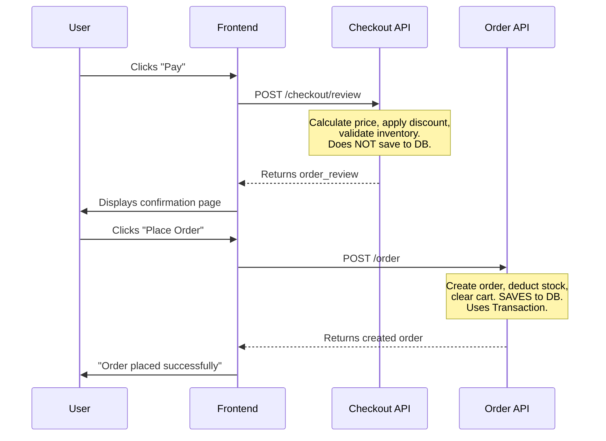
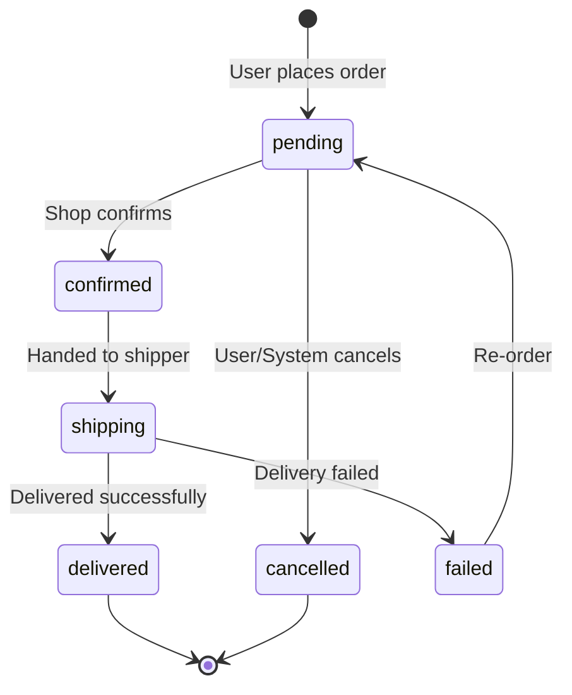
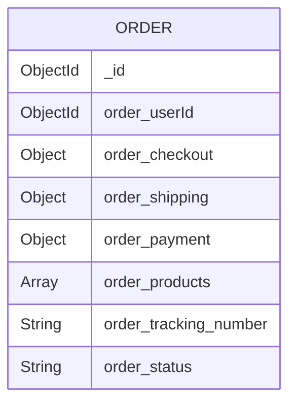

# Guide to Building the Order & Checkout Module

## Table of Contents

1. [Foundational Knowledge](#1-foundational-knowledge)
2. [Database Design](#2-database-design)
3. [Step 1: Create Order Model](#step-1-create-order-model)
4. [Step 2: Update Inventory Repository](#step-2-update-inventory-repository)
5. [Step 3: Create Checkout Service](#step-3-create-checkout-service)
6. [Step 4: Create Order Repository](#step-4-create-order-repository)
7. [Step 5: Create Order Service](#step-5-create-order-service)
8. [Step 6: Create Controllers](#step-6-create-controllers)
9. [Step 7: Create Routes & Register](#step-7-create-routes--register)
10. [Advanced Exercises](#advanced-exercises)

---

# 1. Foundational Knowledge

## Checkout vs Order — What's the Difference?

| | Checkout | Order |
|---|---|---|
| **What is it?** | The process of **reviewing** the order before confirming | An order that **has been confirmed** |
| **Saved to DB?** | **NO** — only calculates and returns | **YES** — saved to the `Orders` collection |
| **When does it happen?** | User clicks "Pay" → review page is shown | User clicks "Confirm Order" |



## Why Separate Checkout from Order?

1. **Separation of Concerns** — Calculation (checkout) and action (order) are two different responsibilities
2. **Better UX** — Users can review the total before confirming
3. **Idempotent** — Calling checkout/review multiple times causes no side effects
4. **Security** — Re-validate price from the server, do not trust the client

## Inventory Reservation Pattern

> [!IMPORTANT]
> This is an extremely important pattern in real-world E-Commerce — it solves race conditions.

**Problem:** 2 users buy the last item at the same time → who gets it?

**Solution:** Use MongoDB atomic operation `$gte` + `$inc`:
```
Stock: 5
User A: qty=3 → inven_stock >= 3? ✅ → stock = 2
User B: qty=3 → inven_stock >= 3? ❌ → return null → throw Error
```

## Order State Machine



---

# 2. Database Design

> [!TIP]
> **Snapshot Pattern:** When creating an order, **copy all product information** (name, price, image) into the order. Reason: If the shop changes the price after the user orders, the order must retain the price at the time of ordering.



---

# Step 1: Create Order Model

### Create file: `features/order/model/index.ts`

```typescript
import { model, Schema } from 'mongoose'

const DOCUMENT_NAME = 'Order'
const COLLECTION_NAME = 'Orders'

export const ORDER_STATUS = Object.freeze({
  PENDING: 'pending',
  CONFIRMED: 'confirmed',
  SHIPPING: 'shipping',
  DELIVERED: 'delivered',
  CANCELLED: 'cancelled',
  FAILED: 'failed',
})

const orderSchema = new Schema(
  {
    order_userId: {
      type: Schema.Types.ObjectId,
      ref: 'Shop', // temporarily using Shop as User
      required: true,
    },
    /*
      order_checkout is a snapshot of the checkout result at the time of ordering.
      Saved so it can be retrieved later without recalculating.
      {
        totalPrice: number,      // total original price
        totalDiscount: number,   // total discount
        feeShip: number,         // shipping fee
        totalCheckout: number,   // actual total amount paid
      }
    */
    order_checkout: {
      type: Object,
      default: {},
      required: true,
    },
    /*
      order_shipping is a snapshot of the shipping information.
      {
        street: string,
        city: string,
        state: string,
        country: string,
      }
    */
    order_shipping: {
      type: Object,
      default: {},
      required: true,
    },
    /*
      order_payment is the payment information.
      {
        method: 'COD' | 'CARD' | 'MOMO',
      }
    */
    order_payment: {
      type: Object,
      default: {},
      required: true,
    },
    /*
      order_products is a snapshot of all products, grouped by shop.
      Structure is similar to shop_order_ids_new from checkout review:
      [
        {
          shopId: string,
          shop_discounts: [{ code, shopId }],
          item_products: [{ productId, price, quantity, name, thumb }],
          price_raw: number,
          price_apply_discount: number,
        }
      ]
    */
    order_products: {
      type: Array,
      required: true,
      default: [],
    },
    order_tracking_number: {
      type: String,
      default: '',
    },
    order_status: {
      type: String,
      enum: Object.values(ORDER_STATUS),
      default: ORDER_STATUS.PENDING,
    },
  },
  {
    timestamps: true,
    collection: COLLECTION_NAME,
  },
)

export const OrderModel = model(DOCUMENT_NAME, orderSchema)
```

---

# Step 2: Update Inventory Repository

### Edit file: `features/inventory/repository/index.ts`

Add 2 functions `reserveInventory` and `releaseInventory` to the existing file.

```typescript
import mongoose from 'mongoose'
import { InventoryModel } from '../models'

// ===== EXISTING FUNCTION — keep as is =====
export const insertInventory = async ({
  product_id,
  shop_id,
  stock,
  location = 'unKnow',
  session,
}: {
  product_id: mongoose.Types.ObjectId
  shop_id: mongoose.Types.ObjectId
  stock: number
  location?: string
  session: mongoose.ClientSession
}) => {
  const payload = {
    inven_product_id: product_id,
    inven_shop_id: shop_id,
    inven_stock: stock,
    inven_location: location,
  }
  if (session) {
    return (await InventoryModel.create([payload], { session }))[0]
  }
  return await InventoryModel.create(payload)
}

// ===== NEW FUNCTIONS — add below =====

/*
  reserveInventory — Reserve a product when creating an order.

  How it works:
  - Uses { $gte: quantity } to check if inventory is sufficient
  - If sufficient → deduct stock ($inc: -quantity) + add reservation
  - If NOT sufficient → findOneAndUpdate returns null

  This is an atomic operation — MongoDB guarantees no race conditions.
  No pessimistic lock needed, no distributed lock needed.
*/
export const reserveInventory = async ({
  productId,
  quantity,
  cartId,
  session,
}: {
  productId: string
  quantity: number
  cartId: string
  session: mongoose.ClientSession
}) => {
  return InventoryModel.findOneAndUpdate(
    {
      inven_product_id: new mongoose.Types.ObjectId(productId),
      inven_stock: { $gte: quantity }, // ONLY update if stock >= quantity
    },
    {
      $inc: { inven_stock: -quantity },
      $push: {
        inven_reservation: {
          quantity,
          cartId,
          createdAt: new Date(),
        },
      },
    },
    {
      new: true,
      session,
    },
  )
}

/*
  releaseInventory — Restore inventory when a user cancels an order.

  How it works:
  - Add the quantity back to stock ($inc: +quantity)
  - Remove the reservation record ($pull)
*/
export const releaseInventory = async ({
  productId,
  quantity,
  cartId,
  session,
}: {
  productId: string
  quantity: number
  cartId: string
  session: mongoose.ClientSession
}) => {
  return InventoryModel.findOneAndUpdate(
    {
      inven_product_id: new mongoose.Types.ObjectId(productId),
    },
    {
      $inc: { inven_stock: quantity }, // add back to stock
      $pull: {
        inven_reservation: { cartId }, // remove reservation
      },
    },
    {
      new: true,
      session,
    },
  )
}
```

> [!WARNING]
> Note: A bug was found in your current `insertInventory` — there are 2 nested `InventoryModel.create` calls. Fix the `if (session)` branch to `return (await InventoryModel.create([payload], { session }))[0]` as shown in the code above.

---

# Step 3: Create Checkout Service

### Create file: `features/checkout/service/index.ts`

```typescript
import { BadRequestError } from '../../../core/error.response'
import { ProductRepository } from '../../product/repository'
import { DiscountService } from '../../discount/services/discount.service'

/*
  Interface for input from the client.
  The client sends products already GROUPED by shop.
  Each shop can have its own discount.
*/
interface ShopOrderItem {
  shopId: string
  shop_discounts: Array<{
    code: string
    shopId: string
  }>
  item_products: Array<{
    productId: string
    quantity: number
    price: number // client sends price → server will VALIDATE it
  }>
}

interface CheckoutReviewPayload {
  cartId: string
  userId: string
  shop_order_ids: ShopOrderItem[]
}

export class CheckoutService {
  /*
    checkoutReview — Calculate the total amount for an order.

    Does NOT save to DB. Does NOT deduct stock. Does NOT have side effects.
    Only reads + calculates + validates + returns the result.

    Flow:
    1. Iterate through each shop in shop_order_ids
    2. For each item: validate product exists + price is correct
    3. Calculate raw price (rawPrice)
    4. Apply discount if available → calculate discountAmount
    5. Calculate price after discount (checkoutPrice)
    6. Return totals
  */
  static checkoutReview = async ({
    cartId,
    userId,
    shop_order_ids,
  }: CheckoutReviewPayload) => {
    // Array of results after validation + price calculation
    const shop_order_ids_new: any[] = []

    // Total variables
    let totalPrice = 0 // total original price
    let totalDiscount = 0 // total discount
    let totalCheckout = 0 // total amount to pay
    const feeShip = 0 // shipping fee (can be calculated later)

    // 1. Iterate through each shop
    for (const shopOrder of shop_order_ids) {
      const { shopId, shop_discounts, item_products } = shopOrder

      // 2. Validate each product
      const validatedProducts: any[] = []
      let rawPrice = 0

      for (const item of item_products) {
        /*
          Always get price from DB, do NOT trust the price sent by the client.
          Why? Because the client can modify prices in devtools.
          Flow:
          - Client sends: { productId, price: 100, quantity: 2 }
          - Server gets from DB: product.product_price = 150
          - Compare: 100 !== 150 → throw Error
        */
        const product = await ProductRepository.getProductPublishedById(
          item.productId,
          ['product_name', 'product_thumb', 'product_price', 'product_shop'],
        )

        if (!product) {
          throw new BadRequestError(
            `Product ${item.productId} not found or not published`,
          )
        }

        // Validate price: client price must equal server price
        if (item.price !== product.product_price) {
          throw new BadRequestError(
            `Product ${product.product_name} price has changed. Please refresh.`,
          )
        }

        // Validate shop: product must belong to the correct shop
        if (product.product_shop?.toString() !== shopId) {
          throw new BadRequestError(
            `Product ${product.product_name} does not belong to this shop`,
          )
        }

        const itemTotal = item.price * item.quantity
        rawPrice += itemTotal

        // Save product snapshot (used for order later)
        validatedProducts.push({
          productId: item.productId,
          price: product.product_price,
          quantity: item.quantity,
          name: product.product_name,
          thumb: product.product_thumb,
        })
      }

      // 3. Apply discount (if any)
      let discountAmount = 0

      if (shop_discounts && shop_discounts.length > 0) {
        /*
          Currently DiscountService.applyDiscount is an instance method,
          so we need to create an instance. If you refactor to a static method
          then call DiscountService.applyDiscount(...) directly.

          Note: applyDiscount currently INCREMENTS the usage count.
          In checkout review, we don't want to increase count yet (user hasn't confirmed).
          → You should create a separate calculateDiscount function in DiscountService
          that only calculates WITHOUT incrementing usage count.
          For now, we call applyDiscount here.
        */
        const discountService = new DiscountService()
        for (const disc of shop_discounts) {
          try {
            const result = await discountService.applyDiscount(
              disc.code,
              userId,
              rawPrice,
              validatedProducts[0]?.productId || '', // first product
            )
            discountAmount += result.discountAmount
          } catch (error) {
            // If discount is invalid → skip or throw depending on business logic
            // Here we throw so the user knows
            throw error
          }
        }
      }

      // 4. Calculate price after discount
      const checkoutPrice = rawPrice - discountAmount

      // 5. Add to totals
      totalPrice += rawPrice
      totalDiscount += discountAmount
      totalCheckout += checkoutPrice

      // 6. Save result for this shop
      shop_order_ids_new.push({
        shopId,
        shop_discounts,
        item_products: validatedProducts,
        price_raw: rawPrice,
        price_apply_discount: checkoutPrice,
      })
    }

    return {
      shop_order_ids, // original input
      shop_order_ids_new, // result after validation + price calculation
      checkout_order: {
        totalPrice,
        totalDiscount,
        feeShip,
        totalCheckout: totalCheckout + feeShip,
      },
    }
  }
}
```

> [!IMPORTANT]
> **Issue with `DiscountService.applyDiscount`:** The current function both calculates the discount and increments the `usage count`. In checkout review, the count should not be incremented yet (since the user hasn't confirmed). You should create a separate `calculateDiscount` function in `DiscountService` that only **calculates** and does **NOT** call `incrementUserCount`. This is left as a refactoring exercise for you.

---

# Step 4: Create Order Repository

### Create file: `features/order/repository/index.ts`

```typescript
import mongoose from 'mongoose'
import { OrderModel } from '../model'
import { createPaginationResponse, parsePagination } from '../../../utils'

export class OrderRepository {
  // Create an order — pass session to be part of a transaction
  static createOrder = async ({
    payload,
    session,
  }: {
    payload: any
    session: mongoose.ClientSession
  }) => {
    return (await OrderModel.create([payload], { session }))[0]
  }

  // Get a paginated list of orders for a user
  static getOrdersByUserId = async ({
    userId,
    page = 1,
    limit = 10,
  }: {
    userId: string
    page?: number
    limit?: number
  }) => {
    const {
      skip,
      limit: limitNum,
      page: pageNum,
    } = parsePagination({ page, limit })

    const [result, total] = await Promise.all([
      OrderModel.find({ order_userId: userId })
        .sort({ createdAt: -1 }) // newest first
        .skip(skip)
        .limit(limitNum)
        .lean()
        .exec(),
      OrderModel.countDocuments({ order_userId: userId }),
    ])

    return createPaginationResponse(result, total, pageNum, limitNum)
  }

  // Get details of a single order
  static getOrderById = async (orderId: string) => {
    return OrderModel.findById(orderId).lean().exec()
  }

  // Update an order's status
  static updateOrderStatus = async ({
    orderId,
    status,
    session,
  }: {
    orderId: string
    status: string
    session?: mongoose.ClientSession
  }) => {
    return OrderModel.findByIdAndUpdate(
      orderId,
      { order_status: status },
      { new: true, lean: true, session },
    )
  }
}
```

---

# Step 5: Create Order Service

### Create file: `features/order/service/index.ts`

```typescript
import mongoose from 'mongoose'
import {
  BadRequestError,
  NotFoundError,
} from '../../../core/error.response'
import { CheckoutService } from '../../checkout/service'
import { reserveInventory, releaseInventory } from '../../inventory/repository'
import { CartService } from '../../cart/service'
import { OrderRepository } from '../repository'
import { ORDER_STATUS } from '../model'

export class OrderService {
  /*
    createOrder — Create an official order.

    This is the most important function. Flow:
    1. Call checkoutReview again to validate + get the latest price
    2. Open a transaction
    3. Reserve inventory (atomically deduct stock)
    4. Create Order document
    5. Clear cart (or remove ordered items from cart)
    6. Commit / Rollback

    Why call checkoutReview again?
    → Because between the time the user views the checkout page and clicks "Place Order"
      several minutes may have passed. Prices may have changed, discounts expired,
      or stock may have run out. ALWAYS recalculate.
  */
  static createOrder = async ({
    cartId,
    userId,
    shop_order_ids,
    user_address,
    user_payment,
  }: {
    cartId: string
    userId: string
    shop_order_ids: any[]
    user_address: {
      street: string
      city: string
      state: string
      country: string
    }
    user_payment: {
      method: string
    }
  }) => {
    // 1. Call checkoutReview again — validate + get latest price
    const checkoutResult = await CheckoutService.checkoutReview({
      cartId,
      userId,
      shop_order_ids,
    })

    const { shop_order_ids_new, checkout_order } = checkoutResult

    // 2. Get all products that need stock deducted
    //    Flatten from shop_order_ids_new into a single products array
    const allProducts = shop_order_ids_new.flatMap(
      (shopOrder: any) => shopOrder.item_products,
    )

    // 3. Open a transaction
    const session = await mongoose.startSession()
    session.startTransaction()

    try {
      // 4. Reserve inventory for each product
      for (const product of allProducts) {
        const reservation = await reserveInventory({
          productId: product.productId,
          quantity: product.quantity,
          cartId,
          session,
        })

        /*
          If reservation === null → insufficient stock.
          findOneAndUpdate with condition { inven_stock: { $gte: quantity } }
          will return null when no matching document is found.
        */
        if (!reservation) {
          throw new BadRequestError(
            `Product ${product.name} is out of stock. Please update your cart.`,
          )
        }
      }

      // 5. Create Order document
      const newOrder = await OrderRepository.createOrder({
        payload: {
          order_userId: new mongoose.Types.ObjectId(userId),
          order_checkout: checkout_order,
          order_shipping: user_address,
          order_payment: user_payment,
          order_products: shop_order_ids_new,
          order_status: ORDER_STATUS.PENDING,
        },
        session,
      })

      if (!newOrder) {
        throw new BadRequestError('Failed to create order')
      }

      // 6. Clear cart after successful order placement
      //    Note: clearCart currently does not accept a session
      //    → For more safety, refactor clearCart to accept a session
      await CartService.clearCart({ userId })

      // 7. Commit transaction
      await session.commitTransaction()

      return newOrder
    } catch (error) {
      // Rollback all changes
      await session.abortTransaction()
      throw error
    } finally {
      session.endSession()
    }
  }

  /*
    getOrdersByUser — Get the list of orders for the current user.
  */
  static getOrdersByUser = async ({
    userId,
    page,
    limit,
  }: {
    userId: string
    page?: number
    limit?: number
  }) => {
    return OrderRepository.getOrdersByUserId({ userId, page, limit })
  }

  /*
    getOrderDetail — Get the details of a single order.
    Checks whether the order belongs to the current user (authorization).
  */
  static getOrderDetail = async ({
    orderId,
    userId,
  }: {
    orderId: string
    userId: string
  }) => {
    const order = await OrderRepository.getOrderById(orderId)
    if (!order) throw new NotFoundError('Order not found')

    // Authorization: only the user who created the order can view it
    if (order.order_userId.toString() !== userId) {
      throw new BadRequestError('You are not authorized to view this order')
    }

    return order
  }

  /*
    cancelOrder — Cancel an order.

    Only allowed when status = 'pending'.
    When cancelling:
    1. Restore inventory (releaseInventory)
    2. Update status = 'cancelled'
  */
  static cancelOrder = async ({
    orderId,
    userId,
  }: {
    orderId: string
    userId: string
  }) => {
    const order = await OrderRepository.getOrderById(orderId)
    if (!order) throw new NotFoundError('Order not found')

    // Authorization
    if (order.order_userId.toString() !== userId) {
      throw new BadRequestError('You are not authorized to cancel this order')
    }

    // Only cancel when status is pending
    if (order.order_status !== ORDER_STATUS.PENDING) {
      throw new BadRequestError(
        `Cannot cancel order with status: ${order.order_status}. Only pending orders can be cancelled.`,
      )
    }

    // Open a transaction
    const session = await mongoose.startSession()
    session.startTransaction()

    try {
      // 1. Restore inventory for each product
      const allProducts = order.order_products.flatMap(
        (shopOrder: any) => shopOrder.item_products,
      )

      for (const product of allProducts) {
        await releaseInventory({
          productId: product.productId,
          quantity: product.quantity,
          cartId: '', // can store cartId in the order to use here
          session,
        })
      }

      // 2. Update status = cancelled
      const cancelledOrder = await OrderRepository.updateOrderStatus({
        orderId,
        status: ORDER_STATUS.CANCELLED,
        session,
      })

      await session.commitTransaction()
      return cancelledOrder
    } catch (error) {
      await session.abortTransaction()
      throw error
    } finally {
      session.endSession()
    }
  }
}
```

---

# Step 6: Create Controllers

### Create file: `features/checkout/controller/index.ts`

```typescript
import { Request, Response } from 'express'
import { OkResponse } from '../../../core/success.response'
import { CheckoutService } from '../service'

class CheckoutController {
  /*
    POST /checkout/review
    Body: { cartId, shop_order_ids: [...] }
    userId is retrieved from the authentication middleware (req.user.userId)
  */
  checkoutReview = async (req: Request, res: Response) => {
    const data = await CheckoutService.checkoutReview({
      ...req.body,
      userId: req.user?.userId,
    })
    return OkResponse.send(res, { data })
  }
}

export default new CheckoutController()
```

### Create file: `features/order/controller/index.ts`

```typescript
import { Request, Response } from 'express'
import { CreatedResponse, OkResponse } from '../../../core/success.response'
import { OrderService } from '../service'

class OrderController {
  /*
    POST /order
    Body: { cartId, shop_order_ids, user_address, user_payment }
  */
  createOrder = async (req: Request, res: Response) => {
    const data = await OrderService.createOrder({
      ...req.body,
      userId: req.user?.userId,
    })
    return CreatedResponse.send(res, { data })
  }

  /*
    GET /order
    Query: ?page=1&limit=10
  */
  getOrdersByUser = async (req: Request, res: Response) => {
    const data = await OrderService.getOrdersByUser({
      userId: req.user?.userId as string,
      page: Number(req.query.page) || 1,
      limit: Number(req.query.limit) || 10,
    })
    return OkResponse.send(res, { data })
  }

  /*
    GET /order/:id
  */
  getOrderDetail = async (req: Request, res: Response) => {
    const data = await OrderService.getOrderDetail({
      orderId: req.params.id as string,
      userId: req.user?.userId as string,
    })
    return OkResponse.send(res, { data })
  }

  /*
    PATCH /order/:id/cancel
  */
  cancelOrder = async (req: Request, res: Response) => {
    const data = await OrderService.cancelOrder({
      orderId: req.params.id as string,
      userId: req.user?.userId as string,
    })
    return OkResponse.send(res, { data })
  }
}

export default new OrderController()
```

---

# Step 7: Create Routes & Register

### Create file: `features/checkout/routes/index.ts`

```typescript
import express from 'express'
import CheckoutController from '../controller'
import { asyncHandler } from '../../../utils'
import { authentication } from '../../auth/utils/checkAuth'

const router = express.Router()

// All checkout routes require authentication
router.use(authentication)

router.post('/review', asyncHandler(CheckoutController.checkoutReview))

export default router
```

### Create file: `features/order/routes/index.ts`

```typescript
import express from 'express'
import OrderController from '../controller'
import { asyncHandler } from '../../../utils'
import { authentication } from '../../auth/utils/checkAuth'

const router = express.Router()

// All order routes require authentication
router.use(authentication)

router.post('/', asyncHandler(OrderController.createOrder))
router.get('/', asyncHandler(OrderController.getOrdersByUser))

// Static routes before dynamic routes (lesson learned from the product module!)
router.patch('/:id/cancel', asyncHandler(OrderController.cancelOrder))
router.get('/:id', asyncHandler(OrderController.getOrderDetail))

export default router
```

### Edit file: `routes/index.ts` — Register new routes

```diff
 import cartRouter from '../features/cart/routes'
+import checkoutRouter from '../features/checkout/routes'
+import orderRouter from '../features/order/routes'
 import { apiKey, permission } from '../features/auth/utils/checkAuth'

 // ...existing code...

 router.use('/cart', cartRouter)
+router.use('/checkout', checkoutRouter)
+router.use('/order', orderRouter)
```

---

# Final Directory Structure

```
features/
├── checkout/                        ← NEW
│   ├── controller/index.ts
│   ├── service/index.ts
│   └── routes/index.ts
│
├── order/                           ← NEW
│   ├── controller/index.ts
│   ├── model/index.ts
│   ├── repository/index.ts
│   ├── service/index.ts
│   └── routes/index.ts
│
├── inventory/
│   └── repository/index.ts          ← EDITED (added reserve + release)
│
├── cart/
│   └── ... (unchanged)
│
└── routes/index.ts                  ← EDITED (registered new routes)
```

---

# Implementation Order

| Step | File | Action |
|------|------|--------|
| 1 | `features/order/model/index.ts` | Create new |
| 2 | `features/inventory/repository/index.ts` | Edit — add `reserveInventory` + `releaseInventory` |
| 3 | `features/checkout/service/index.ts` | Create new |
| 4 | `features/order/repository/index.ts` | Create new |
| 5 | `features/order/service/index.ts` | Create new |
| 6 | `features/checkout/controller/index.ts` | Create new |
| 7 | `features/order/controller/index.ts` | Create new |
| 8 | `features/checkout/routes/index.ts` | Create new |
| 9 | `features/order/routes/index.ts` | Create new |
| 10 | `routes/index.ts` | Edit — add import + `router.use` |

---

# Testing with Postman

### 1. Checkout Review
```
POST /api/checkout/review
Headers: x-client-id, authorization, x-api-key
Body:
{
  "cartId": "<cartId from cart>",
  "shop_order_ids": [
    {
      "shopId": "<shopId>",
      "shop_discounts": [],
      "item_products": [
        {
          "productId": "<productId>",
          "quantity": 2,
          "price": 150000
        }
      ]
    }
  ]
}
```

### 2. Create Order
```
POST /api/order
Headers: x-client-id, authorization, x-api-key
Body:
{
  "cartId": "<cartId>",
  "shop_order_ids": [ ... ],  // same as checkout review
  "user_address": {
    "street": "123 ABC",
    "city": "HCM",
    "state": "HCM",
    "country": "VN"
  },
  "user_payment": {
    "method": "COD"
  }
}
```

### 3. Get Orders
```
GET /api/order?page=1&limit=10
Headers: x-client-id, authorization, x-api-key
```

### 4. Cancel Order
```
PATCH /api/order/<orderId>/cancel
Headers: x-client-id, authorization, x-api-key
```

---

# Advanced Exercises

### 1. Separate `calculateDiscount` from `applyDiscount`
Currently `applyDiscount` both calculates and increments the usage count. Create a `calculateDiscount` function that only **calculates** (used during checkout review) and `applyDiscount` that is only called when **actually creating an order**.

### 2. Refactor `clearCart` to accept a session
Currently cart clearing happens outside the transaction. If clearing the cart fails → the order is created but the cart still exists.

### 3. Store `cartId` in the order
So that when cancelling an order, the `cartId` can be used to accurately call `releaseInventory`.

### 4. Order History
Every time the status changes → push to an `order_history` array:
```typescript
order_history: [{
  status: 'confirmed',
  changed_by: shopId,
  changed_at: new Date(),
  note: 'Shop has confirmed the order',
}]
```

### 5. Payment Integration
Pattern: Create order with `status = pending_payment` → redirect to VNPay/MoMo → receive webhook → update `status = confirmed`.
