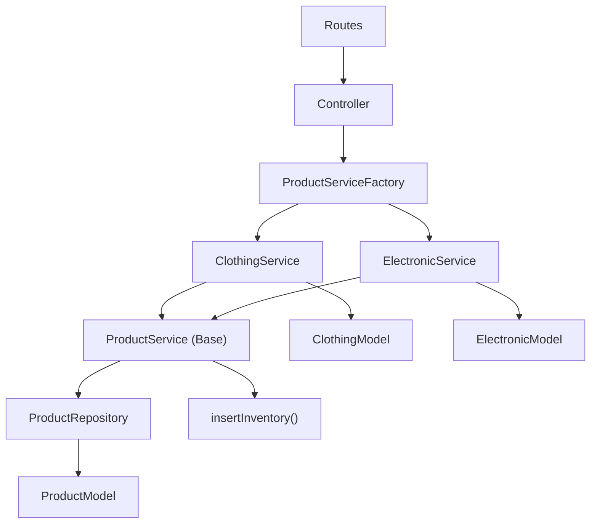

# Product Module — Review & Hướng dẫn cải thiện

## Tổng quan

Module Product quản lý toàn bộ vòng đời sản phẩm trong hệ thống E-Commerce. Module sử dụng **Factory + Strategy Pattern** để hỗ trợ tạo và cập nhật nhiều loại sản phẩm khác nhau mà không cần sửa đổi code gốc.

## Kiến trúc

```
product/
├── controller/index.ts   # Xử lý HTTP request/response
├── dto/index.ts           # Định nghĩa kiểu dữ liệu (payload)
├── model/index.ts         # Mongoose schemas & models
├── repository/index.ts    # Truy vấn database
├── routes/index.ts        # Định nghĩa API endpoints
└── service/index.ts       # Business logic (Factory + Strategy)
```



---

# Các vấn đề cần sửa

## 🔴 BUG 1: Route ordering — `/:id` nuốt `/draft` và `/published`

> [!CAUTION]
> Đây là bug **production-breaking**. Route `GET /draft` và `GET /published` sẽ **KHÔNG BAO GIỜ** được gọi tới.

### Giải thích

Trong Express, routes được match **theo thứ tự khai báo**. Khi bạn viết:

```typescript
// Line 9 — khai báo TRƯỚC
router.get('/:id', asyncHandler(ProductController.getDetailProduct))

// ... authentication middleware ...

// Line 15, 16 — khai báo SAU
router.get('/draft', asyncHandler(ProductController.getDraftProductByShop))
router.get('/published', asyncHandler(ProductController.getPublishedProductByShop))
```

Khi client gọi `GET /draft`, Express match `/:id` trước với `id = "draft"` → trả về "product not found" thay vì danh sách draft. Routes `/draft` và `/published` **không bao giờ được chạm tới**.

### Cách sửa — file `routes/index.ts`

**Nguyên tắc:** Luôn đặt **static routes trước dynamic routes**.

```typescript
const router = express.Router()

// ====== PUBLIC routes (không cần auth) ======
router.get('/', asyncHandler(ProductController.searchProducts))
// /:id đặt CUỐI CÙNG trong nhóm public
router.get('/:id', asyncHandler(ProductController.getDetailProduct))

// ====== PRIVATE routes (cần auth) ======
router.use(authentication)

router.post('/', asyncHandler(ProductController.createProduct))

// Static routes TRƯỚC
router.get('/draft', asyncHandler(ProductController.getDraftProductByShop))
router.get('/published', asyncHandler(ProductController.getPublishedProductByShop))

// Dynamic routes SAU
router.patch('/published/:id', asyncHandler(ProductController.setPublishedProductByShop))
router.patch('/draft/:id', asyncHandler(ProductController.setDraftProductByShop))
router.patch('/:id', asyncHandler(ProductController.updateProduct))
```

---

## 🔴 BUG 2: `insertInventory` nằm ngoài transaction

> [!CAUTION]
> Nếu `insertInventory` fail, product đã được tạo nhưng inventory thì không → **data inconsistency**.

### Giải thích

Trong `ProductService.createProduct()` (service line 180-200):

```typescript
async createProduct(session, product_id) {
  const newProduct = (await ProductModel.create(
    [{ ...this.toProductObject(), _id: product_id.toString() }],
    { session },            // ✅ trong transaction
  ))[0]

  await insertInventory({   // ❌ NGOÀI transaction!
    product_id: newProduct._id,
    shop_id: ...,
    stock: ...,
  })

  return newProduct
}
```

`ProductModel.create()` có truyền `{ session }` → nằm trong transaction.  
Nhưng `insertInventory()` **không truyền session** → nằm ngoài transaction.

Nếu `insertInventory()` throw error → transaction rollback product, nhưng nếu `insertInventory` tạo xong rồi mới có error sau đó → inventory tồn tại mà product thì không.

### Cách sửa

**Bước 1:** Sửa `insertInventory` trong `inventory/repository/index.ts` để nhận thêm `session`:

```typescript
export const insertInventory = async ({
  product_id,
  shop_id,
  stock,
  location = 'unKnow',
  session,            // <-- thêm param này
}: {
  product_id: mongoose.Types.ObjectId
  shop_id: mongoose.Types.ObjectId
  stock: number
  location?: string
  session?: mongoose.ClientSession  // <-- thêm type
}) => {
  // Dùng array syntax + options khi có session
  if (session) {
    return (await InventoryModel.create(
      [{ inven_product_id: product_id, inven_shop_id: shop_id, inven_stock: stock, inven_location: location }],
      { session }
    ))[0]
  }
  return await InventoryModel.create({
    inven_product_id: product_id,
    inven_shop_id: shop_id,
    inven_stock: stock,
    inven_location: location,
  })
}
```

**Bước 2:** Sửa `ProductService.createProduct()` truyền `session`:

```typescript
async createProduct(session, product_id) {
  // ...tạo product...
  await insertInventory({
    product_id: newProduct._id,
    shop_id: new mongoose.Types.ObjectId(this.product_shop),
    stock: this.product_quantity,
    session,   // <-- truyền session vào
  })
  return newProduct
}
```

---

## 🔴 BUG 3: `ElectronicService` nuốt error gốc

> [!WARNING]
> Khi có lỗi, bạn mất hoàn toàn thông tin debug.

### Giải thích

So sánh 2 service:

```typescript
// ClothingService — ✅ TỐT: throw lại error gốc
} catch (error) {
  await session.abortTransaction()
  throw error   // giữ nguyên message + stack trace
}

// ElectronicService — ❌ XẤU: nuốt error gốc
} catch (error) {
  await session.abortTransaction()
  throw new InternalServerError()  // mất hết thông tin lỗi!
}
```

### Cách sửa — file `service/index.ts`, class `ElectronicService`

Đổi `throw new InternalServerError()` thành `throw error` (giống `ClothingService`).

---

## 🟡 VẤN ĐỀ 4: `removeNullUndefinedObject` được import nhưng không dùng

### Giải thích

Ở service line 15:
```typescript
import { flattenObject, removeNullUndefinedObject } from '../../../utils'
```

Nhưng trong toàn bộ file service, **không có chỗ nào gọi** `removeNullUndefinedObject`. Hàm `flattenObject` đã tự bỏ qua `null`/`undefined` rồi (xem `common.ts` line 78-80).

### Cách sửa

Xóa `removeNullUndefinedObject` khỏi import.

---

## 🟡 VẤN ĐỀ 5: `ClothingService.updateProduct` không return kết quả

### Giải thích

```typescript
// ClothingService
async updateProduct(product_id, payload) {
  const flattenedPayload = flattenObject(payload)
  const updatedProduct = await super.updateProduct(product_id, flattenedPayload)
  console.log('🚀 ~ updatedProduct:', updatedProduct)  // ← console.log trong production
  if (payload.product_attributes) {
    // ...update clothing attributes...
  }
  // ❌ KHÔNG CÓ return! → Controller nhận `undefined` → client nhận data: undefined
}
```

### Cách sửa

1. Xóa `console.log`
2. Thêm `return updatedProduct` cuối hàm

---

## 🟡 VẤN ĐỀ 6: `ElectronicService` thiếu `updateProduct` override

### Giải thích

`ClothingService` override `updateProduct` để cập nhật cả collection `clothes`.  
Nhưng `ElectronicService` **không override** → khi update electronic product có `product_attributes`, chỉ collection `Products` được update, collection `electronics` **không được update**.

### Cách sửa

Thêm `updateProduct` cho `ElectronicService`, tương tự `ClothingService` nhưng dùng `ElectronicModel`:

```typescript
// Trong class ElectronicService
async updateProduct(product_id, payload) {
  const flattenedPayload = flattenObject(payload)
  const updatedProduct = await super.updateProduct(product_id, flattenedPayload)
  if (payload.product_attributes) {
    const flattenedProductAttributes = flattenObject(payload.product_attributes)
    await ProductRepository.findAndUpdate({
      product_id,
      payload: flattenedProductAttributes,
      model: ElectronicModel,
    })
  }
  return updatedProduct
}
```

---

## 🟡 VẤN ĐỀ 7: `ElectronicService.createProduct` thiếu `product_shop`

### Giải thích

So sánh:

```typescript
// ClothingService — ✅ truyền product_shop
const createClothing = await ClothingModel.create(
  [{ ...this.product_attributes, product_shop: this.product_shop }],
  { session }
)

// ElectronicService — ❌ KHÔNG truyền product_shop
const createElectronic = await ElectronicModel.create(
  [this.product_attributes],  // thiếu product_shop!
  { session }
)
```

Schema `electronicSchema` có field `product_shop` nhưng `ElectronicService` không truyền vào.

### Cách sửa

Sửa thành:
```typescript
const createElectronic = await ElectronicModel.create(
  [{ ...this.product_attributes, product_shop: this.product_shop }],
  { session }
)
```

---

## 🟢 CẢI THIỆN 8: Controller thiếu input validation

### Giải thích

Controller hiện tại nhận `req.body` và truyền thẳng vào service mà **không validate** gì. Ví dụ:

```typescript
createProduct = async (req: Request, res: Response) => {
  const data = await ProductServiceFactory.createProduct({
    ...req.body,           // ← client gửi gì cũng nhận
    product_shop: req.user?.userId,
  })
}
```

Rủi ro:
- Client gửi thiếu field bắt buộc → Mongoose throw ugly validation error
- Client gửi field thừa/lạ → có thể tạo data không mong muốn
- `req.query.page` và `req.query.limit` là `string`, cast `as unknown as number` nhưng thực tế vẫn là string

### Hướng sửa (có thể làm sau)

Tạo validation middleware dùng thư viện như `zod` hoặc `joi`. Ví dụ với `zod`:

```typescript
// dto/index.ts — thêm schema validation
import { z } from 'zod'

export const createProductSchema = z.object({
  product_name: z.string().min(1),
  product_thumb: z.string().url(),
  product_description: z.string().optional(),
  product_price: z.number().positive(),
  product_quantity: z.number().int().nonnegative(),
  product_type: z.enum(['ELECTRONICS', 'CLOTHING', 'SHOES', 'OTHER']),
  product_attributes: z.record(z.any()),
})
```

---

## 🟢 CẢI THIỆN 9: Quá nhiều `any` type

### Giải thích

Các vị trí dùng `any` làm mất lợi thế TypeScript:

| File | Vị trí | Type `any` |
|------|--------|------------|
| service | `productRegister: Record<string, any>` | Class constructor |
| service | `product_attributes: any` | Mixed attributes |
| service | `createProduct(payload: any)` | Product creation payload |
| repository | `query: any` trong `searchProducts` | Search query |
| dto | `product_attributes: any` | Product attributes |

### Hướng sửa (có thể làm sau)

Dần thay thế `any` bằng type cụ thể. Ưu tiên:
1. `createProduct(payload: any)` → dùng `BaseProductPayload` từ dto
2. `productRegister` → dùng generic type cho constructor
3. `product_attributes` → định nghĩa union type cho từng loại sản phẩm

---

# Tổng kết — Thứ tự ưu tiên sửa

| # | Vấn đề | Mức độ | File cần sửa |
|---|--------|--------|--------------|
| 1 | Route ordering (`/:id` nuốt `/draft`, `/published`) | 🔴 Bug | `routes/index.ts` |
| 2 | `insertInventory` ngoài transaction | 🔴 Bug | `service/index.ts` + `inventory/repository/index.ts` |
| 3 | `ElectronicService` nuốt error gốc | 🔴 Bug | `service/index.ts` |
| 4 | Unused import `removeNullUndefinedObject` | 🟡 Cleanup | `service/index.ts` |
| 5 | `ClothingService.updateProduct` không return | 🟡 Bug | `service/index.ts` |
| 6 | `ElectronicService` thiếu `updateProduct` | 🟡 Missing feature | `service/index.ts` |
| 7 | `ElectronicService` thiếu `product_shop` khi create | 🟡 Bug | `service/index.ts` |
| 8 | Thiếu input validation ở controller | 🟢 Improvement | `controller/index.ts` + `dto/index.ts` |
| 9 | Quá nhiều `any` type | 🟢 Improvement | Nhiều files |
